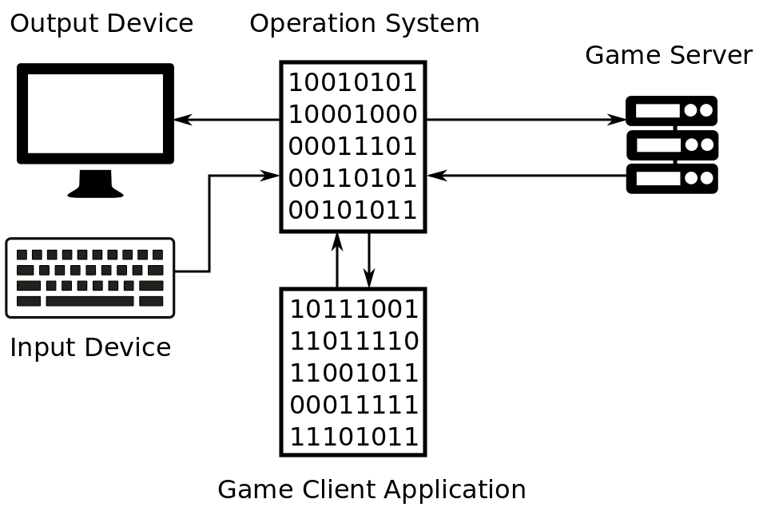

# Game Application

It will be appropriate to consider how the video game applications works before we start investigation of the bot applications. 

You can see the key components and communications of the typical on-line game application on this scheme:

Game client application is one of plenty processes that are launched on the operation system (OS) of your PC. Each application have a separate memory sandbox that have been [allocated by OS](http://duartes.org/gustavo/blog/post/anatomy-of-a-program-in-memory/). OS provides access to all devices like monitor, keyboard, mouse, network adapter for the game client application. OS process requests from the application to output data by sending it through network adapter to game server or by displaying picture on the screen. Also OS notifies the application about input data events like keyboard key pressing or receiving network packet from the game server at the same time. OS performs all these tasks using the drivers and system libraries. Both these kinds of software are combined in the OS block in our scheme for simplification. 

Let's consider concrete player actions and things that happens in the game application as a result. Suppose, you want to move your character. You press the appropriate arrow key on the keyboard. The keyboard driver signals OS by interruption mechanism that the key have been pressed. OS handle this notification and pass it to the application which have an active state at the moment. Game application receives key press notification from OS and changes position of the character by updating player's coordinates value in the application's memory. Then game application ask OS to update current picture at the screen according to the new character position. OS ask graphics library like OpenGL or DirectX to draw a new picture on the screen. Next task is notification of game server that player position have been changed. Game application prepare network packet and ask OS to send it. That is all what needed for moving the character.

Another case is a game event that happens by result of other player's actions or internal game's reasons. The game server sends network packet with event description to the OS. OS passes the received packet to the game application. Game application changes current state of the game model by updating own memory and updates picture at the screen with the help of OS.

The game application model that have been considered here is common enough to cover work principles of the most modern popular online games. The game genre like RPG, real-time strategy, shooter, sports and etc. is not important in this case. All of them use similar mechanisms and client-server architecture.

This scheme should be corrected slightly if we decide to consider games with the single play mode only. The game server should be excluded from the scheme. All player actions affects the game application's memory only and keep storing on the local PC. But mechanism of input data through the keyboard and output to the screen stay the same as online games ones.
