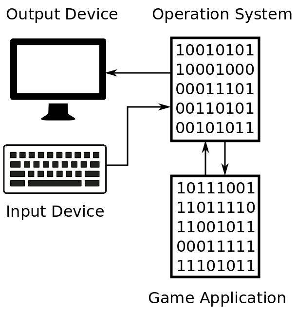

# Game Application

It will be appropriate to consider how the video game applications works before we start investigation of the bot applications. 

You can see the key components and communications of the typical on-line game application on this scheme:

Game client application is one of the plenty computing processes that are launched on the operation system (OS) of your PC. Each application have a separate memory sandbox that have been allocated by OS. OS provides access to all devices like monitor, keyboard, mouse, network adapter for the game client application. OS handles requests from the application to output data by sending it through network adapter to game server or by displaying picture on the screen. Also OS notifies the application about input data events like keyboard key pressing or receiving network packet from the game server. OS performs all these tasks using the drivers and system libraries. Both these kinds of software are combined in the OS block in our scheme for simplification. 

Now we will consider concrete player actions and things that happen in our scheme as a result. Suppose, you want to move your character. You press the appropriate arrow key on the keyboard to do it. This is a list of actions that happen to provide character's moving:

1. The keyboard driver signals OS by interrupt mechanism that the key have been pressed.
2. OS handles the keyboard driver notification and notifies about it an application which have an active state at the moment.
3. Game application receives the key press notification from OS and requires OS to send network packet to the game server for notification about the new character position.
4. Game server validates the new character position and send confirmation to the game client if the position is correct according to the game rules.
5. OS notify the game application about the game server confirmation.
6. Game application updates the state of game objects in the application's memory according to the new character position.
7. Game application requires OS to update current picture at the screen according to the new state of game objects.
8. OS requires a graphics library like OpenGL or DirectX to draw a new picture on the screen. 
9. Graphic library performs calculations for the new picture and draw it using the video driver.

That is all what is needed for moving the character. 

The algorithm will be quite similar in the case of an action that happens by result of other player's activity or some special game condition. The steps from 5 to 9 will be performed in this case. The game server notifies application that something have been changed. Game application updates state of the game objects and refresh the screen picture according to it.

The game application scheme that have been considered here is common enough to cover work principles of the most modern popular on-line games. The game genre like RPG, real-time strategy, shooter, sports and etc is not important in this case. All of them use similar mechanisms and client-server architecture.

This scheme should be corrected slightly if we decide to consider games with the single play mode only:

The game server should be excluded from the scheme. All player actions and game conditions affect the application's memory only and keep storing on the local PC. Please note that the state of the game objects is stored both on game server side and on game client side in case of on-line games. But the server side information have a priority. This means that if the state of game objects on server side and client side differs the server side state will be chosen as a genuine. Nobody controls correctness of the game objects state in a memory in case of a single player game.

Mechanism of the game application working with a keyboard and a screen through OS, drivers and system libraries stay the same for single player and on-line games.