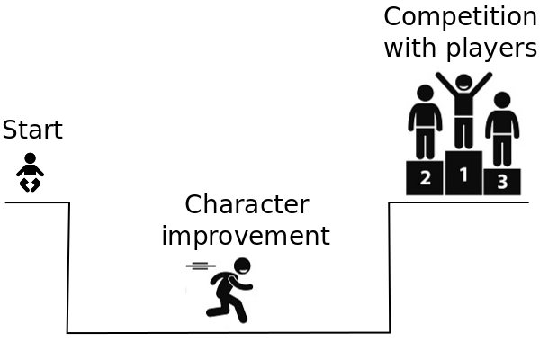
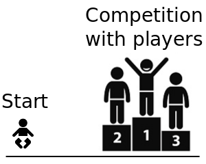
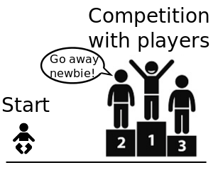

# Purpose of Bots

Why the video game bots is needed? This is the first question that you can ask when you hear about video game bots. Really, the video games are developed to make players fun and relax. But this question is not so simple as seems.

Let`s look at the gameplay process of typical role-playing game (RPG).

You start playing by character without any powerful items and capabilities. The long path of killing stupid monsters and performing boring quests lies in front of you. This is the most obvious way to get game resources, items and improve your character
skills. More interesting part of the game is fighting and competing with other players but this part still unavailable for you until you don`t complete the long path of improvement your character.

The alternative way to improve your character is in-game purchases. The modern video games in most cases allow you to buy all that you need to compete with another players and start to get fun quickly. The gameplay process became look like this:

But the question is are you sure that you will find exact what you want after paying your money and compete with players give you a lot of fun?

The idea of automation the process of improvement your character appears here. The monotonous repeated actions of killing obedient monsters or performing the quests are exactly the thing that can be automated well. You can just put boring task on the shoulders of the bot application and have fun when it will completes the work. This
kind of automation is just one of the bots possible purposes.

Another case that make you think about changing something is video games with difficult interface of controlling your character. The most known example of this case is Warcraft III Defense of the Ancients (DotA) mod. The gameplay was significant changed in this
mod compared to gameplay of the original game. Developers have not possibility to make suitable user interface because of Warcraft III mod development tools limitations. The player should remember the hotkeys for each of 112 available characters and this is impossible to change ones. The bot application is able to help you here too. The keyboard keys mapping is an elementary task that able to be done with the simple script. Moreover, you can improve interface by some automation of common performed actions like macros that allow you to bind several keystrokes on single keyboard key, automatically target search on the game screen for selected action and etc.

The last case when bots applications can be handy is you really want to cheat and avoid the game limitations. The most common example of this task is showing the invisible things at the game screen like other players, object parameters and etc. The bot application should penetrate inside your game's algorithms and data after that extract the information that you needed.

As you have seen, bot applications able to make your life easy and get more fun of playing your favorite video game.