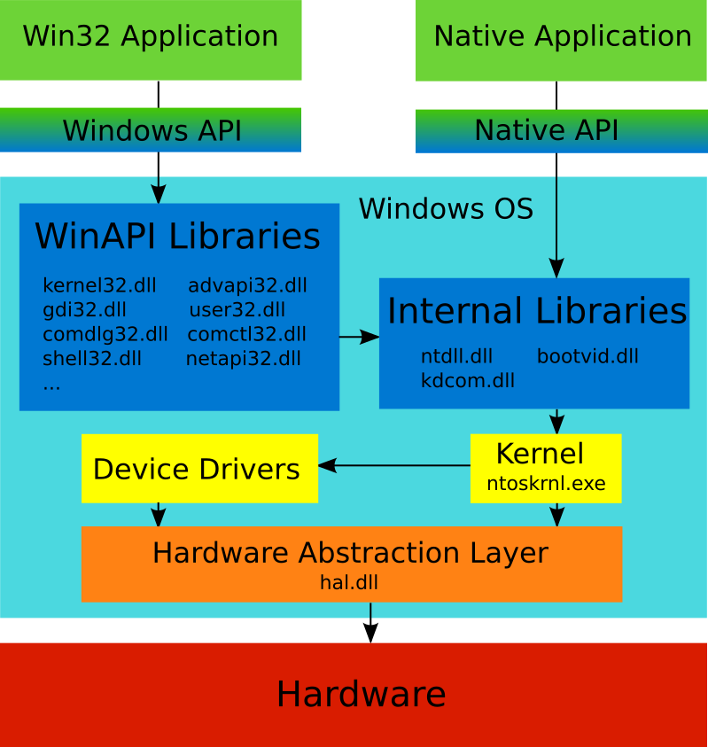

# OS Level Embedding Data

## Windows API

Main goal of OS is to manage software and hardware resources and to provide access for launched applications to them. Memory, CPU and peripheral devices are examples of the hardware resources that are managed by OS. Example of the software resources are algorithms that are implemented into the system libraries. The Windows operating system will be described throughout the book.

The picture illustrates how Windows provides access to the resources:



Every launched application can ask Windows to perform an action like new window creation, drawing a line on the screen, sending packet via network, allocating memory, etc. All of these actions are implemented in subroutines. Subroutines that solve tasks from one domain are gathered into system libraries. You can see kernel32.dll, gdi32.dll and other system libraries at the picture. 

The way for application to call Windows subroutines is strictly defined, well documented and kept unchanged. This way of communication is called Windows Application Programming Interface (API) or Windows API (WinAPI). The reason of importance API entity is keeping compatibility of new versions of an applications and new versions of Windows. WinAPI can be compared with some kind of contract. If application will follow the contract Windows promises to perform its requests with a certain result.

There are two kinds of applications pictured here. Win32 application is an application that interacts with a subset of Windows libraries through WinAPI. Win32 is a historical name for this kind of applications that appears in the first 32-bit version of Windows (Windows NT). These libraries provide high level subroutines. High level means that these subroutines operate with complex abstractions like window, control, file, etc. The subset of Windows libraries that are available through WinAPI are called WinAPI libraries.

Second kind of applications is a native application. This application interacts with underlying internal Windows libraries and [**kernel**](https://en.wikipedia.org/wiki/Kernel_%28operating_system%29) through [**Native API**](https://en.wikipedia.org/wiki/Native_API). The libraries become available during system boot stage, when other components of Windows are unavailable. Also these libraries provide low-level subroutines. Low-level subroutines operate simple abstractions like memory page, process, thread, etc.

The WinAPI libraries use subroutines of the native library for implementing their complex abstractions. The implementation of internal libraries is based onto kernel functions that are available through the system calls. 

Device drivers provide simplified representation of the devices for the overlying libraries. The representation includes a set of subroutines which implement typical actions with device. These subroutines are available for WinAPI libraries and Internal libraries through the kernel.

[**Hardware Abstraction Layer**](https://en.wikipedia.org/wiki/Microsoft_Windows_library_files#Hal.dll) (HAL) is a software that performs some representation of the physical hardware. The main goal of this layer is assisting in launching Windows on different kinds of hardware. HAL provides subroutines with the hardware specific implementation for both device drivers and kernel. But the interface of subroutines is kept the same and it does not depend on the underlying hardware. It allows drivers and kernel developers to minimize changes in source code to port Windows on new platforms.

## Keyboard Strokes Emulation

### Keystroke in Active Window

First of all it will be useful to investigate AutoIt provided ways for keyboard strokes emulation. The most appropriate way is a [`Send`](https://www.autoitscript.com/autoit3/docs/functions/Send.htm) function according to the list of [available options](https://www.autoitscript.com/autoit3/docs/functions.htm).

Our test application will press the "a" key in the already opened Notepad window. This is an algorithm of the application work:

1. Find an opened Notepad window.
2. Switch to the Notepad window.
3. Emulate "a" key pressing.

The Notepad window can be found with the [`WinGetHandle`](https://www.autoitscript.com/autoit3/docs/functions/WinGetHandle.htm) function. The first parameter of the function can be window title, window handle or window class. We will specify the window class as a more reliable option. These are steps to discover class of the Notepad window:

1. Open the `C:\Program Files (X86)\AutoIt3\Au3Info.exe` application. Your AutoIt installation path can be different.
2. Drag-and-drop "Finder Tool" to the Notepad window.
3. You will get result like this:


The information that we are looking for is specified in the "Class" field of the "Basic Window Info" block. The value of the window class is "Notepad".

This is a [`Send.au3`](https://ellysh.gitbooks.io/video-game-bots/content/Examples/ClickerBots/OSLevelEmbeddingData/Send.au3) script that implements key pressing algorithm:
```AutoIt
$hWnd = WinGetHandle("[CLASS:Notepad]")
WinActivate($hWnd)
Send("a")
```
Here we get window handle of the Notepad window with the `WinGetHandle` function. Next step is switching to the window with the `WinActivate` function. And last step is emulating "a" key press. You can just put this code into the file with `Send.au3` name and launch it by double clicking.

### AutoIt Send Function Internals

Actually the `Send` AutoIt function uses one of the WinAPI subroutines or functions. It will be useful to discover which one of the possible WinAPI functions have been used. API Monitor is a suitable tool for hooking API calls that are made by an application. We will rely on it in our research.

These are steps to monitor `Send.au3` script's WinAPI calls:

1. Launch the API Monitor 32-bit application.
2. Find *Ctrl+F* and select the "Keyboard an Mouse Input" item in the "API Filter" child window.
3. Press *Ctrl+M* to open the "Monitor New Process" dialog.
4. Specify `C:\Program Files (x86)\AutoIt3\AutoIt3.exe` application in the "Process" field and click "OK" button.
5. Specify the `Send.au3` script in the opened "Run Script" dialog. The script will be launched after this action.
6. Find *Ctrl+F* the 'a' text (with single quotes) in the "Summary" child window of the API Monitor application.

You will get a result similar to this:


`VkKeyScanW` is a function that explicitly gets the "a" character as parameter. But it does not perform the keystroke emulation according to WinAPI documentation. Actually, `VkKeyScanW` and called next `MapVirtualKeyW` functions are used to prepare input parameters for the [`SendInput`](https://msdn.microsoft.com/en-us/library/windows/desktop/ms646310%28v=vs.85%29.aspx) WinAPI function. `SendInput` performs actual work of emulating keystroke.

Now we can try to implement our algorithm of pressing "a" key in the Notepad window through a direct interaction with WinAPI functions. The most important thing now is the way to keystrokes emulation. Thus, usage of high-level `WinGetHandle` and `WinActivate` AutoIt function will be kept.

This is a [`SendInput.au3`](https://ellysh.gitbooks.io/video-game-bots/content/Examples/ClickerBots/OSLevelEmbeddingData/SendInput.au3) script that implements the algorithm through WinAPI interaction:
```AutoIt
$hWnd = WinGetHandle("[CLASS:Notepad]")
WinActivate($hWnd)

Const $KEYEVENTF_UNICODE = 4
Const $INPUT_KEYBOARD = 1
Const $iInputSize = 28

Const $tagKEYBDINPUT = _
    'word wVk;' & _
    'word wScan;' & _
    'dword dwFlags;' & _
    'dword time;' & _
    'ulong_ptr dwExtraInfo'
    
Const $tagINPUT = _
    'dword type;' & _
    $tagKEYBDINPUT & _
    ';dword pad;'

$tINPUTs = DllStructCreate($tagINPUT)
$pINPUTs = DllStructGetPtr($tINPUTs)
$iINPUTs = 1
$Key = AscW('a')

DllStructSetData($tINPUTs, 1, $INPUT_KEYBOARD)
DllStructSetData($tINPUTs, 3, $Key)
DllStructSetData($tINPUTs, 4, $KEYEVENTF_UNICODE)

DllCall('user32.dll', 'uint', 'SendInput', 'uint', $iINPUTs, 'ptr', $pINPUTs, 'int', $iInputSize)
```
We call `SendInput` WinAPI function through the [`DllCall`](https://www.autoitscript.com/autoit3/docs/functions/DllCall.htm) AutoIt function here. You should specify the library name, WinAPI function name, return type and function's input parameters for the `DllCall`. Preparation of the input parameters for `SendInput` is the biggest part of work done in the `SendInput.au3` script. 

First parameter of the `SendInput` function is a number of [**structures**](https://en.wikipedia.org/wiki/Struct_%28C_programming_language%29) with the [`INPUT`](https://msdn.microsoft.com/en-us/library/windows/desktop/ms646270%28v=vs.85%29.aspx) type. Only one structure is used in our example. Thus, the `iINPUTs` variable is equal to one.

Second parameter is a [**pointer**](https://en.wikipedia.org/wiki/Pointer_%28computer_programming%29) to the array of `INPUT` structures. It is also possible to pass a pointer to a single structure. We use the `tagINPUT` variable for representing structure's fields according to the WinAPI documentation. Significant fields here are the first one with the `type` name and the second unnamed one with the [`KEYBDINPUT`](https://msdn.microsoft.com/en-us/library/windows/desktop/ms646271%28v=vs.85%29.aspx) type. You probably noticed that we have a situation of nested structures. The `INPUT` structure contains within itself the `KEYBDINPUT` one. The `tagKEYBDINPUT` variable is used for representing fields of the `KEYBDINPUT` structure. The `tagINPUT` variable is used for creating structure in the process memory by [`DllStructCreate`](https://www.autoitscript.com/autoit3/docs/functions/DllStructCreate.htm) call. Next step is receiving pointer of the created `INPUT` structure with the [`DllStructGetPtr`](https://www.autoitscript.com/autoit3/docs/functions/DllStructGetPtr.htm) function. And the last step is writing actual data to the `INPUT` structure with the [`DllStructSetData`](https://www.autoitscript.com/autoit3/docs/functions/DllStructSetData.htm) function.

Third parameter of the `SendInput` function is a size of a single `INPUT` structure. This is a constant and equals to 28 bytes in our case:
```
dword + (word + word + dword + dword + ulong_ptr) + dword =  4 + (2 + 2 + 4 + 4 + 8) + 4 = 28
```
The question is why we need the last padding dword field in the `INPUT` structure. If you look into the `INPUT` definition you will see the `union` C++ keyword. This means that the reserved memory size will be enough for storing the biggest of the `MOUSEINPUT`, `KEYBDINPUT` and `HARDWAREINPUT` structures. The biggest structure is `MOUSEINPUT` that has dword extra field compared to `KEYBDINPUT`.

Now you can see the benefits of using high-level language such as AutoIt. It hides from the developer a lot of inconsiderable details and allows to operate with simple abstractions and functions.

### Keystroke in Inactive Window

The `Send` AutoIt function emulates keystroke in the window that is active at the moment. It means that you can not minimize or switch to background the window where you want to emulate keystrokes. This is not suitable in some cases. AutoIt contains a function that is useful in this situation. This is a [`ControlSend`](https://www.autoitscript.com/autoit3/docs/functions/ControlSend.htm) function. 

We can rewrite our `Send.au3` script to use `ControlSend` function. This is a source of [`ControlSend.au3`](https://ellysh.gitbooks.io/video-game-bots/content/Examples/ClickerBots/OSLevelEmbeddingData/ControlSend.au3) script:
```AutoIt
$hWnd = WinGetHandle("[CLASS:Notepad]")
ControlSend($hWnd, "", "Edit1", "a")
```
You can see that now we should specify the control name, class or id which will process the keystroke. The control has an `Edit1` classname in our case according to information from Au3Info tool.

We can use the API Monitor application to clarify the underlying WinAPI function that is called by `ControlSend`. This is a [`SetKeyboardState`](https://msdn.microsoft.com/en-us/library/windows/desktop/ms646314%28v=vs.85%29.aspx) WinAPI function. You can try to rewrite our `ControlSend.au3` application to use `SetKeyboardState` function directly for an exercise.

But now we face a difficulty with sending keystrokes to the maximized DirectX window. The problem is that DirectX window has no internal controls. Actually, it will work correctly if you just skip the `controlID` parameter of the `ControlSend` function.

This is a [`ControlSendDirectx.au3`](https://ellysh.gitbooks.io/video-game-bots/content/Examples/ClickerBots/OSLevelEmbeddingData/ControlSendDirectx.au3) script that emulates the `a` keystroke in the inactive Warcraft III window:
```AutoIt
$hWnd = WinGetHandle("Warcraft III")
ControlSend($hWnd, "", "", "a")
```
You can see that we used the "Warcraft III" window title here to get the window handle. Discovering this window title has become tricky because it is impossible to switch off a fullscreen mode of the DirectX window in most cases. The problem is tools like Au3Info do not give you any possibility to gather information from fullscreen windows. You can use an API Monitor application for this goal. Just move mouse cursor on the desired process in the "Running Process" child window. This is example for the Notepad application:


If the target process does not exist in the child window you can try to enter into administrator mode of API Monitor application or launch 32 or 64 API Monitor version.

Some fullscreen windows may not have a title text. The alternative solution is addressing to the window by the window's class. But API Monitor does not provide window's class information.

This is a [`GetWindowTitle.au3`](https://ellysh.gitbooks.io/video-game-bots/content/Examples/ClickerBots/OSLevelEmbeddingData/GetWindowTitle.au3) script that shows you a title text and a window class of currently active window:
```AutoIt
#include <WinAPI.au3>

Sleep(5 * 1000)
$handle = WinGetHandle('[Active]')
MsgBox(0, "", "Title   : " & WinGetTitle($handle) & @CRLF & "Class : " & _WinAPI_GetClassName($handle))
```
First line contains [`include`](https://www.autoitscript.com/autoit3/docs/keywords/include.htm) keyword that allows you to append specified file to the current script. `WinAPI.au3` file contains a defintion of the [`_WinAPI_GetClassName`](https://www.autoitscript.com/autoit3/docs/libfunctions/_WinAPI_GetClassName.htm) function that performs a necessary job. The script will sleep for five seconds after the start. This is performed by the [`Sleep`](https://www.autoitscript.com/autoit3/docs/functions/Sleep.htm) function. You should switch to the fullscreen window while the script sleeps. After sleep end handle of the current active window will be saved into the `handle` variable. Last action shows a message box with the [`MsgBox`](https://www.autoitscript.com/autoit3/docs/functions/MsgBox.htm) function having necessary information.

## Mouse Actions Emulation

The keyboard stroke emulation should be enough for controlling player character in some games. But most of modern video games have complex control systems using both keyboard and mouse. AutoIt language has several functions that allow you to emulate typical mouse actions like clicking, moving and holding mouse button pressed. Now we will review them.

### Mouse Actions in Active Window

We will test our mouse emulation examples in the standard Microsoft Paint application window. This is a [`MouseClick.au3`](https://ellysh.gitbooks.io/video-game-bots/content/Examples/ClickerBots/OSLevelEmbeddingData/MouseClick.au3) script that performs a mouse click in the active Paint window:
```AutoIt
$hWnd = WinGetHandle("[CLASS:MSPaintApp]")
WinActivate($hWnd)
MouseClick("left", 250, 300)
```
You should launch the Paint application, switch to the "Brushes" tool and launch the "MouseClick.au3" script. You will see a black dot at the x=250 and y=300 coordinates. The "ColorPix" application that has been mentioned in the [Tools](tools.md) section will help you check the coordinate correctness. The [`MouseClick`](https://www.autoitscript.com/autoit3/docs/functions/MouseClick.htm) AutoIt function has been used in the example. You can specify these function parameters:

1. Which mouse button will be clicked.
2. Coordinates of the click action.
3. Number of clicks.
4. Mouse movement speed to the specified coordinates.

The [`mouse_event`](https://msdn.microsoft.com/en-us/library/windows/desktop/ms646260%28v=vs.85%29.aspx) WinAPI function is used by `MouseClick`.

Now it is time to review coordinate systems that are used by AutoIt mouse functions. Three modes to specify mouse coordinates are available in AutoIt:

| Mode | Description |
| -- | -- |
| 0 | Relative coordinates to the active window |
| 1 | Absolute screen coordinates. This mode is used by default. |
| 2 | Relative coordinates to the client area of the active window |

This is an illustration of the mentioned options:


You can see numbered red dots on the picture. Each number defines a type of the dot's coordinate system. For example, dot with number "0" has coordinates relative to the active window. The indexed "x" and "y" letters are corresponding coordinates of each dot.

You can switch between types of coordinate systems with `MouseCoordMode` parameter of the [`Opt`](https://www.autoitscript.com/autoit3/docs/functions/AutoItSetOption.htm) AutoIt function. This is a modified `MouseClick.au3` script that will use a relative coordinates to the client area of the active window:
```AutoIt
Opt("MouseCoordMode", 2)
$hWnd = WinGetHandle("[CLASS:MSPaintApp]")
WinActivate($hWnd)
MouseClick("left", 250, 300)
```
You can launch this script and see that coordinates of the newly drawn dot in the Paint window differ. Usage of the 2nd mode with a relative coordinates to the client area of window will give you more reliable results. It works well both for windowed and full-screen modes of an application. But it may be harder to check relative coordinates with a tool like CoolPix. Most of these tools measure the absolute screen coordinates.

Clicking a mouse button and dragging a cursor is a common action in video games. AutoIt provides a [`MouseClickDrag`](https://www.autoitscript.com/autoit3/docs/functions/MouseClickDrag.htm) function that performs this kind of action.  This is a [`MouseClickDrag.au3`](https://ellysh.gitbooks.io/video-game-bots/content/Examples/ClickerBots/OSLevelEmbeddingData/MouseClickDrag.au3) script that demonstrates a work of the `MouseClickDrag` function inside the Paint window:
```AutoIt
$hWnd = WinGetHandle("[CLASS:MSPaintApp]")
WinActivate($hWnd)
MouseClickDrag("left", 250, 300, 400, 500)
```
You will see a drawn line inside the Paint window. Starting absolute screen coordinates of the line are x=250 and y=300. End coordinates are x=400 and y=500. The same `mouse_event` WinAPI function is used by `MouseClickDrag` one.

Both AutoIt functions `MouseClick` and `MouseClickDrag` perform mouse actions in the current active window.

### Mouse Actions in Inactive Window

AutoIt provides [ControlClick.htm](https://www.autoitscript.com/autoit3/docs/functions/ControlClick.htm) function that allows you to emulate mouse click into the inactive window. This is a [`ControlClick.au3`](https://ellysh.gitbooks.io/video-game-bots/content/Examples/ClickerBots/OSLevelEmbeddingData/ControlClick.au3) script for example:
```AutoIt
$hWnd = WinGetHandle("[CLASS:MSPaintApp]")
ControlClick($hWnd, "", "Afx:00000000FFC20000:81", "left", 1, 250, 300)
```
It performs a mouse click inside the inactive or minimized Paint window. The `ControlClick` function is very similar to `ControlSend` one. You should specify the control in which mouse click will be emulated. The control for drawing in the Paint application has a `Afx:00000000FFC20000:81` classname according to the information from Au3Info tool.

You can notice that `MouseClick` and `ControlClick` functions perform mouse clicks in different places when passed input coordinates are the same. The coordinates in `ControlClick` function are relative coordinates to the control in which the mouse click is performed. This means that mouse click in our example will occur at the point with x=250 and y=300 from the left-up corner of the control for drawing. The coordinate system of the `MouseClick` function is defined by the `MouseCoordMode` AutoIt option.

The job of AutoIt `ControlClick` function is performed by two calls to [`PostMessageW`](https://msdn.microsoft.com/en-us/library/windows/desktop/ms644944%28v=vs.85%29.aspx) WinAPI function:


First call to `PostMessageW` has a `WM_LBUTTONDOWN` input parameter. It allows to emulate mouse button down action. Second call has a `WM_LBUTTONUP` parameter for mouse up emulation correspondingly.

The `ControlClick` function works very unreliably with minimized DirectX windows. Some of tested applications just ignore this emulation of mouse actions. Other applications process actions only after application's window activation. This behavior looks like a limitation of the Windows messaging mechanism that is used by `ControlClick` function.