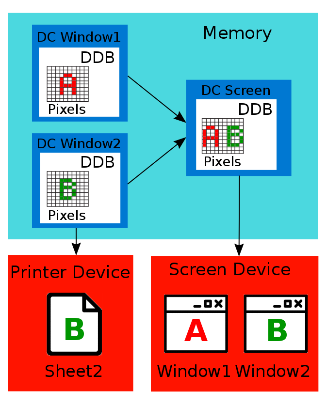

# Output Devices Capture

## Windows Graphics Device Interface

[**Graphics Device Interface**](https://en.wikipedia.org/wiki/Graphics_Device_Interface) (GDI) is one of basic Windows operating system's components. It is responsible for working with graphical objects. All visual elements of a typical application's window are constructed using the graphical objects. Examples of these objects are Device Contexts, Bitmaps, Brushes, Colors and Fonts.

This scheme represents a relationship between the graphical objects and devices:



Core concept of the GDI library is a [**Device Context**](https://msdn.microsoft.com/en-us/library/windows/desktop/dd162467%28v=vs.85%29.aspx) (DC). DC is an abstraction that allows developers to operate with the graphical objects in a one universal way for all supported output devices. Examples of the devices are display, printer, plotter and etc. All operations with the DC are performed into a memory before sending a result to the output device.

You can see two DCs in the scheme that match to the windows of two applications. Also this is a DC of the entire screen that represents overall Windows desktop. The screen DC is obtained by composing a DCs' content of all visible windows and desktop visual elements like a taskbar. Also it possible to send content of each window to the printer device and get a sheet with content of window's DC.

DC is a structure in a memory. Developers can interact with it only through the WinAPI functions. Each DC contains a [**Device Depended Bitmap**](https://msdn.microsoft.com/en-us/library/windows/desktop/dd183561%28v=vs.85%29.aspx) (DDB). [**Bitmap**](https://msdn.microsoft.com/en-us/library/windows/desktop/dd162461%28v=vs.85%29.aspx) is a in-memory representation of the drawing surface. Any manipulation with any graphic object in the DC affects the bitmap. Therefore, the bitmap contains a result of all performed operations.

Simplistically, the bitmap consist of a rectangle of pixels. Each pixel has two parameters that are coordinates and color. Compliance of the parameters are defined by two dimensional array. Indexes of the array's element defines a pixel coordinates. Numeric value of the element defines a color code in the color-palette that is associated with the bitmap. The array should be processed sequentially pixel-by-pixel for analyzing the bitmap.

When a DC has been prepared for the output, it should be passed to the device specific library for example to Vga.dll for a screen device. The library transforms a data from DC to the device driver's representation. Then the driver becomes able to display a DC content on the screen.

## AutoIt Analysis Functions

### Analysis of Specific Pixel

AutoIt provides several functions that simplifies analysis of a current screen picture. All these functions operate with the GDI library objects.

Coordinate systems that are used by the AutoIt pixel analyzing functions are totally the same as coordinate systems for AutoIt mouse functions. This is a list of the available coordinate systems:

| Mode | Description |
| -- | -- |
| 0 | Relative coordinates to the specified window |
| 1 | Absolute screen coordinates. This mode is used by default. |
| 2 | Relative coordinates to the client area of the specified window |

You can use the same [`Opt`](https://www.autoitscript.com/autoit3/docs/functions/AutoItSetOption.htm) AutoIt function with `PixelCoordMode` parameter to switch between the coordinate systems. This is an example of enabling the mode of relative coordinates to the client area:
```AutoIt
Opt("PixelCoordMode", 2)
```
Elementary AutoIt function to get a pixel color is  [`PixelGetColor`](https://www.autoitscript.com/autoit3/docs/functions/PixelGetColor.htm). Input parameters of the function are pixel coordinates. Return value is a decimal code of the pixel color. This is an example [`PixelGetColor.au3`](https://ellysh.gitbooks.io/video-game-bots/content/Examples/ClickerBots/OutputDeviceCapture/PixelGetColor.au3) script that demonstrates the function usage:
```AutoIt
$color = PixelGetColor(200, 200)
MsgBox(0, "", "The hex color is: " & Hex($color, 6))
```
You will see a message box with a color code after launching the script. Sample text of the message is "The text color is: 0355BB". It means that the pixel with absolute coordinates equal to x=200 and y=200 has a color value "0355BB" in the [hexadecimal representation](http://www.htmlgoodies.com/tutorials/colors/article.php/3478951). We have transformed a decimal code that has been returned by the function to a hexadecimal code with the [`Hex`](https://www.autoitscript.com/autoit3/docs/functions/Hex.htm) function. Hexadecimal color representation is widespread and the most of graphical editors and tools use it. Resulting color value "0355BB" will be changed when you switch to another window that covers coordinates x=200 y=200. It means that `PixelGetColor` does not analyze a specific window but the entire desktop picture instead.

This is a screenshoot of API Monitor application with hooked WinAPI calls from the script:


You can see that AutoIt `PixelGetColor` function wraps [`GetPixel`](https://msdn.microsoft.com/en-us/library/windows/desktop/dd144909%28v=vs.85%29.aspx) WinAPI function. Also a [`GetDC`](https://msdn.microsoft.com/en-us/library/windows/desktop/dd144871%28v=vs.85%29.aspx) WinAPI function is called before the `GetPixel` function. Input parameter of the `GetDC` function equals to "NULL". It means that a desktop DC has been selected for further operations. We can avoid this limitation by a specifying a window to analyze. It allows our script to analyze inactive window that is overlapped by another one.

This is a [`PixelGetColorWindow.au3`](https://ellysh.gitbooks.io/video-game-bots/content/Examples/ClickerBots/OutputDeviceCapture/PixelGetColorWindow.au3) script that passes a third parameter to the `PixelGetColor` function to specify a window for analysis:
```AutoIt
$hWnd = WinGetHandle("[CLASS:MSPaintApp]")
$color = PixelGetColor(200, 200, $hWnd)
MsgBox(0, "", "The hex color is: " & Hex($color, 6))
```
The script should analyze a pixel into the Paint application window even the window has been overlapped. Expected value of the pixel color is "FFFFFF" (white). But if you overlap the Paint window by another window with a not white color, the result of script executing is different. The API Monitor log of calls WinAPI functions for `PixelGetColorWindow.au3` script will be the same as for `PixelGetColor.au3` one. The "NULL" parameter is still passed to the `GetDC` WinAPI function. It looks like a bug of the `PixelGetColor` function implementation in AutoIt v3.3.14.1 version. Probably, it will be fixed in the next AutoIt version. But we still need to find a solution for reading from a specific window.

Problem of `PixelGetColorWindow.au3` script is incorrect use of the `GetDC` WinAPI function. We can avoid it in case all steps of the `PixelGetColor` Autoit function are performed directly through the WinAPI calls.

This is example of direct WinAPI calls implementation in a [`GetPixel.au3`](https://ellysh.gitbooks.io/video-game-bots/content/Examples/ClickerBots/OutputDeviceCapture/GetPixel.au3) script:
```AutoIt
#include <WinAPIGdi.au3>

$hWnd = WinGetHandle("[CLASS:MSPaintApp]")
$hDC = _WinAPI_GetDC($hWnd)
$color = _WinAPI_GetPixel($hDC, 200, 200)
MsgBox(0, "", "The hex color is: " & Hex($color, 6))
```
`WinAPIGdi.au3` script is included in the example. It provides `_WinAPI_GetDC` and `_WinAPI_GetPixel` wrappers to the corresponding WinAPI functions. You will see a message box with the correct color code after launching the script. Now result of the script execution is not depend of the windows overlapping and our goal is achieved. 

But the script will not work properly when you minimize a Paint window. Same result equals to the white color are returned if you minimize the window. It seems correctly at first look. But try to change a color of canvas in the Paint window to a red for example. If the window is in a normal mode (not minimized), the script returns a correct red color. If the window is minimized, the script returns the white color. It happens because a minimized window has a zero sized client area. Therefore, the bitmap that is selected in the minimized window DC does not contain any information about a client area. The client area lacks in this case.

This is a [`GetClientRect.au3`](https://ellysh.gitbooks.io/video-game-bots/content/Examples/ClickerBots/OutputDeviceCapture/GetClientRect.au3) script that measures a size of a window's client area:
```AutoIt
#include <WinAPI.au3>

$hWnd = WinGetHandle("[CLASS:MSPaintApp]")
$tRECT = _WinAPI_GetClientRect($hWnd)
MsgBox(0, "Rect", _
            "Left: " & DllStructGetData($tRECT, "Left") & @CRLF & _
            "Right: " & DllStructGetData($tRECT, "Right") & @CRLF & _
            "Top: " & DllStructGetData($tRECT, "Top") & @CRLF & _
            "Bottom: " & DllStructGetData($tRECT, "Bottom"))
```
Each of `Left`, `Right`, `Top` and `Bottom` variables will be equal to zero for the minimized Paint window. You can compare this result with a measured result for the same window in a normal mode.

Possible solution to avoid this limitation is restoring a window in the transparent mode and copying a window's client area with [`PrintWindow`](https://msdn.microsoft.com/en-us/library/dd162869%28VS.85%29.aspx) WinAPI function. Then it is possible to analyze a copy of the window's client area with the `_WinAPI_GetPixel` function. This technique is  described in details [here](http://www.codeproject.com/Articles/20651/Capturing-Minimized-Window-A-Kid-s-Trick).

### Analysis of Pixels Changing

AutoIt provides functions that allow you to analyze happened changes on a game screen. `PixelGetColor` function relies on the predefined pixel coordinates. But this approach is not reliable enough for dynamically changed pictures. [`PixelSearch`](https://www.autoitscript.com/autoit3/docs/functions/PixelSearch.htm) AutoIt function can help in this case.

This is a [`PixelSearch.au3`](https://ellysh.gitbooks.io/video-game-bots/content/Examples/ClickerBots/OutputDeviceCapture/PixelSearch.au3) script that demonstrates the function usage:
```AutoIt
$coord = PixelSearch(0, 207, 1000, 600, 0x000000)
If @error = 0 then
    MsgBox(0, "", "The black point coord: x = " & $coord[0] & " y = " & $coord[1])
else
    MsgBox(0, "", "The black point not found")
endif
```
The script looks for a pixel with the `0x000000` (black) color in a rectangle between two points with coordinates x=0 y=207 and x=1000 y=600. Message with coordinates of the found pixel is displayed if the searching process has succeed. Otherwise, message with a unsuccessful result will be displayed. The [`error`](https://www.autoitscript.com/autoit3/docs/functions/SetError.htm) macro is used here to distinguish success of the `PixelSearch` function. You can launch a Paint application and draw a black point on white canvas. In case you launch the script, you get coordinates of the black point. The Paint window should be active and not overlapped for proper work of the script.

Now we will investigate internal WinAPI calls that is used by the `PixelSearch` function. Launch the `PixelSearch.au3` script from API Monitor application. Search a "0, 207" text in a "Summary" window when the script has finished. You will find a call of [`StretchBlt`](https://msdn.microsoft.com/en-us/library/windows/desktop/dd145120%28v=vs.85%29.aspx) WinAPI function:


`StretchBlt` function performs copying a bitmap from the desktop's DC to the created in a memory compatible DC. You can verify this assumption by comparing input parameters and a returning values of the `GetDC`, [`CreateCompatibleDC`](https://msdn.microsoft.com/en-us/library/windows/desktop/dd183489%28v=vs.85%29.aspx) and `StretchBlt` function calls. Next step is a call of [`GetDIBits`](https://msdn.microsoft.com/en-us/library/windows/desktop/dd144879%28v=vs.85%29.aspx) function. Result of the function is retrieving pixels of screen's DDB to the [**Device Independent Bitmap**](https://msdn.microsoft.com/en-us/library/windows/desktop/dd183562%28v=vs.85%29.aspx) (DIB). DIB format is the most convenient for analysis because it allows to process a bitmap as a regular array. Probable next step of the pixel searching algorithm is a pixel-by-pixel checking color in the received DIB. None WinAPI function is needed to perform this kind of checking. Therefore, you do not see any other calls in the API Monitor log. You can find an example of the image capturing algorithm that is written in C++ [here](https://msdn.microsoft.com/en-us/library/dd183402%28v=VS.85%29.aspx). It allows you to understand internals of AutoIt `PixelSearch` function better.

The `PixelSearch` function has a window handle input parameter which has a default value. This value is able to be ignored. The default value means that the entire desktop will be used for searching a pixel. Otherwise, the function will analyze pixels of the specified window.

This is a [`PixelSearchWindow.au3`](https://ellysh.gitbooks.io/video-game-bots/content/Examples/ClickerBots/OutputDeviceCapture/PixelSearchWindow.au3) script that demonstrates usage of the window handle parameter:
```AutoIt
$hWnd = WinGetHandle("[CLASS:MSPaintApp]")
$coord = PixelSearch(0, 207, 1000, 600, 0x000000, 0, 1, $hWnd)
If @error = 0 then
    MsgBox(0, "", "The black point coord: x = " & $coord[0] & " y = " & $coord[1])
else
    MsgBox(0, "", "The black point not found")
endif
```
The script should analyze an overlapped Paint window but it does not. API Monitor log for this script is still the same as a log of `PixelSearch.au3` one. The `GetDC` function receives a "NULL" as input parameter. Therefore, `PixelSearch` function process a desktop DC always. You can try to avoid it the same way as we have considered for `PixelGetColor` function.

[`PixelChecksum`](https://www.autoitscript.com/autoit3/docs/functions/PixelChecksum.htm) is another AutoIt function that can be handy to analyze dynamically changing pictures. `PixelGetColor` and `PixelSearch` functions provides a precise information of the specified pixel. `PixelChecksum` works different. It allows you to detect that something has been changed into the specified region of a screen. This kind of information is useful for performing a bot's reaction algorithms for happened game events. But a further detailed analysis of the detected events is needed.

This is a [`PixelChecksum.au3`](https://ellysh.gitbooks.io/video-game-bots/content/Examples/ClickerBots/OutputDeviceCapture/PixelChecksum.au3) script with a typical use case of the function:
```AutoIt
$checkSum = PixelChecksum(0, 0, 50, 50)

while $checkSum = PixelChecksum(0, 0, 50, 50)
    Sleep(100)
wend

MsgBox(0, "", "Something in the region has changed!")
```
The script shows you a message box in case something is changed in a desktop region between two points with coordinates x=0 y=0 and x=50 y=50. Initial value of a checksum is calculated in a first line of the script. Further, the checksum value is recalculated and checked every 100 milliseconds into a [`while`](https://www.autoitscript.com/autoit3/docs/keywords/While.htm) loop. The `while` loop continues until the checksum value is still the same.

Now we consider how a `PixelChecksum` function works internally. API Monitor shows us exact the same WinAPI function calls for the `PixelChecksum` as for `PixelSearch` function. It means that AutoIt uses the same algorithm for both of these functions to get a DIB. Next step is checksum calculation for the DIB with a selected algorithm. You can select either [**ADLER**](https://en.wikipedia.org/wiki/Adler-32) or [**CRC32**](https://en.wikipedia.org/wiki/Cyclic_redundancy_check) algorithm for checksum. Difference between the algorithms is a speed and a reliability. CRC32 algorithm works slower but detects a pixels changing better.

The considered AutoIt functions are able to process pictures in fullscreen DirectX windows.

## Advanced Image Analysis Libraries

### FastFind Library

We have explored screen analysis functions that are provided by AutoIt itself. Now we will investigate external tools that are provided by third-party libraries.

[**FastFind**](https://www.autoitscript.com/forum/topic/126430-advanced-pixel-search-library/) library provides advanced functions for searching pixels on a screen. The library's functions can be called from both AutoIt scripts and C++ applications.

These are steps to access the library's functions from an AutoIt script:

1\. Create a project directory for your project for example with `FFDemo` name. 

2\. Copy a `FastFind.au3` script from the library archive into the `FFDemo` directory.

3\. Copy either `FastFind.dll` or `FastFind64.dll` file from the library archive to the `FFDemo` directory. The `FastFind64.dll` file is appropriate for x64 Windows systems. Otherwise, you should use `FastFind.dll` file.

4\. Include the `FastFind.au3` script into your AutoIt script with an `include` keyword:
```AutoIt
#include "FastFind.au3"
```
Now you can call functions of the FastFind library from your AutoIt script.

These are steps to compile a C++ application with the FastFind library:

1\. Download a preferable C++ compiler. [**Visual Studio Community IDE**](https://www.visualstudio.com/en-us/products/visual-studio-express-vs.aspx#) from Microsoft website or [**MinGW**](http://nuwen.net/mingw.html) environment.

2\. Install the C++ compiler on your computer.

3\. Create a source file with `test.cpp` name in case you use a MinGW compiler. Create a "Win32 Console Application" project in case you use Visual Studio IDE.

4\. This is a content of the [`test.cpp`](https://ellysh.gitbooks.io/video-game-bots/content/Examples/ClickerBots/OutputDeviceCapture/FastFindCpp/test.cpp) source file:
```C++
#include <iostream>

#define WIN32_LEAN_AND_MEAN
#include <windows.h>

using namespace std;

typedef LPCTSTR(CALLBACK* LPFNDLLFUNC1)(void);

HINSTANCE hDLL;               // Handle to DLL
LPFNDLLFUNC1 lpfnDllFunc1;    // Function pointer
LPCTSTR uReturnVal;

int main()
{
    hDLL = LoadLibraryA("FastFind");
    if (hDLL != NULL)
    {
        lpfnDllFunc1 = (LPFNDLLFUNC1)GetProcAddress(hDLL,
            "FFVersion");
        if (!lpfnDllFunc1)
        {
            // handle the error
            FreeLibrary(hDLL);
            cout << "error" << endl;
            return 1;
        }
        else
        {
            // call the function
            uReturnVal = lpfnDllFunc1();
            cout << "version = " << uReturnVal << endl;
        }
    }
    return 0;
}
```
5\. Copy the `FastFind.dll` file into the project directory.

6\. In case you use MinGW, create a file with [`Makefile`](https://ellysh.gitbooks.io/video-game-bots/content/Examples/ClickerBots/OutputDeviceCapture/FastFindCpp/Makefile) name with this content:
```Makefile
all:
    g++ test.cpp -o test.exe
```
7\. Build the application with `make` command for MinGW and *F7* hotkey for Visual Studio.

Now you get an executable binary file. You can launch it and get a message with a version number of the FastFind library in a console. Sample message is "version = 2.2".

We have used an [explicitly library linking](https://msdn.microsoft.com/en-us/library/784bt7z7.aspx) approach here. Alternative approach is an [implicitly library linking](https://msdn.microsoft.com/en-us/library/d14wsce5.aspx). But you should use exactly the same C++ compiler version as a library developer for the implicit linking.

Now we will consider possible tasks that can be solved by the FastFind library. First task is looking for an area containing the best number of pixels with the given color. This is a screenshoot of popular MMORPG game Lineage 2:


You can see on the screenshot a player character with "Zagstruck" name and a monster with "Wretched Archer" name. We can use FastFind library to figure out a monster's position on the screen. `FFBestSpot` is an appropriate function for this task. It allows to find an area with the best number of pixels of the given color. Best targets to search are the text labels under both characters. In this case you will get the most reliable results. Also you can use the character models as search targets. But the search algorithm makes wrong decisions very often in this case. It happens because the character models are affected by shadows, light effects and also they can rotate. Wide variation of pixel colors is a consequent of all these effects. Therefore, result of `FFBestSpot` function will vary. Monster has an extra green label under it. This lable is a perfect search target for us.

This is a [`FFBestSpot.au3`](https://ellysh.gitbooks.io/video-game-bots/content/Examples/ClickerBots/OutputDeviceCapture/FastFindAu3/FFBestSpot.au3) script that performs a search of the green text and returns its coordinates:
```AutoIt
#include "FastFind.au3"

Sleep(5 * 1000)

const $sizeSearch = 80
const $minNbPixel = 50
const $optNbPixel = 200
const $posX = 700
const $posY = 380

$coords = FFBestSpot($sizeSearch, $minNbPixel, $optNbPixel, $posX, $posY, _
                     0xA9E89C, 10)

if not @error then
    MsgBox(0, "Coords", $coords[0] & ", " & $coords[1])
else
    MsgBox(0, "Coords", "Match not found.")
endif
```
You can launch this script, switch to the window with the Lineage 2 screenshot and get coordinates of the green text after five seconds. The script sleeps five second after starting that gives you a time to switch the needed window. After that `FFBestSpot` function is called. This is a list of parameters that are passed to the function:

| Parameter | Description |
| -- | -- |
| `sizeSearch` | Width and height of the area to looking for |
| `minNbPixel` | Minimum number of pixels with a given color in the area |
| `optNbPixel` | Optimal number of pixels with a given color in the area |
| `posX` | X coordinate of a proximity position of the area |
| `posY` | Y coordinate of a proximity position of the area |
| `0xA9E89C` | Pixels' color in a hexadecimal representation |
| `10` | Shade variation parameter from 0 to 255 that defines an allowed deviation from the specified color for red, blue and green color's components |

Return value of the function is an array with three elements in case of success and zero value in case of failure. First two elements of the array are X and Y coordinates of the found area. Third element is a number of matched pixels in the area. You can find a detailed information about this function in documentation of FastFind library.

`FFBestSpot` function is an effective tool for searching the interface elements like progress bars, icons, windows and text. Also you can try to search 2D models but result will not be reliable enough.

Second task that can be solved with FastFind library is localization of the screen picture changes. This task is solved by `FFLocalizeChanges` function. We can use Notepad application to demonstrate work of the function. AutoIt script will localize the added text in the Notepad window.

This is a [`FFLocalizeChanges.au3`](https://ellysh.gitbooks.io/video-game-bots/content/Examples/ClickerBots/OutputDeviceCapture/FastFindAu3/FFLocalizeChanges.au3) script:
```AutoIt
#include "FastFind.au3"

Sleep(5 * 1000)
FFSnapShot(0, 0, 0, 0, 0)

MsgBox(0, "Info", "Change a picture now")

Sleep(5 * 1000)
FFSnapShot(0, 0, 0, 0, 1)

$coords = FFLocalizeChanges(0, 1, 10)

if not @error then
    MsgBox(0, "Coords", "x1 = " & $coords[0] & ", y1 = " & $coords[1] & _
           " x2 = " & $coords[2] & ", y2 = " & $coords[3])
else
    MsgBox(0, "Coords", "Changes not found.")
endif
```
This is the algorithm to test `FFLocalizeChanges` function with the script:

1. Launch Notepad application and maximize its window.
2. Launch `FFLocalizeChanges.au3` script.
3. Switch to the Notepad window. 
4. Wait a message box with "Change a picture now" text.
5. Type several symbols into the Notepad window.
6. Wait a message box with coordinates of the added text. It should appear after five seconds since the previous message box.

Functions of the FastFind library operating with **SnapShots**. SnapShot is a term of the library and it means a copy of the screen in a memory. The SnapShot has been taken implicitly in previous script by `FFBestSpot` function. But we take two SnapShot explicitly by `FFSnapShot` function in the `FFLocalizeChanges.au3` script. First SnapShot is taken in five seconds after the script launching. This delay is needed for switching to the Notepad window. Second SnapShot is taken in five seconds after the showing a message box with "Change a picture now" text. This delay is needed for performing your actions that will change the screen picture.

`FFSnapShot` function takes these parameters:

| Parameter | Description |
| -- | -- |
| `0` | X coordinate of the left-top SnapShot area's corner |
| `0` | Y coordinate of the left-top SnapShot area's corner |
| `0` | X coordinate of the right-bottom SnapShot area's corner |
| `0` | Y coordinate of the right-bottom SnapShot area's corner. The whole screen is copied in case all coordinates are zeroed. |
| `0` or `1` | Last parameter is a number of the SnapShot slot. The maximum slot number is 1023. |

Next `FFLocalizeChanges` function takes three parameters:

| Parameter | Description |
| -- | -- |
| `0` | Slot number of the first SnapShot to compare |
| `1` | Slot number of the second SnapShot to compare |
| `10` | Shade variation parameter that works in the same way as for `FFBestSpot` function one |

Return value of the function is an array with five elements in case of success and zero value in case of failure. First four elements of the array are left, top, right and bottom coordinates of the changed region. Last element is a number of the changed pixels.

`FFLocalizeChanges` function is effective alternative for the AutoIt provided `PixelChecksum`. It is more reliable and provides more information about the happened changes.

Functions of the FastFind library supports work with overlapped but not minimized windows. Most of the functions have a window handle parameter that allows to specify a window for analyzing. Also the functions works correctly with DirectX windows in the fullscreen mode.

### ImageSearch Library

[**ImageSearch**](https://www.autoitscript.com/forum/topic/148005-imagesearch-usage-explanation) is a library that solves only one specific task. It allows to find a specified picture in an entire screen or in the specified region of a screen. Steps to access the library's functions from AutoIt script are similar to FastFind library ones:

1. Create a project directory for your project for example with `ImageSearchDemo` name.
2. Copy `ImageSearch.au3` file into the `ImageSearchDemo` directory.
3. Copy `ImageSearchDLL.dll` library into the `ImageSearchDemo` directory.
4. Include the `ImageSearch.au3` file into your AutoIt script:
```AutoIt
#include "ImageSearch.au3"
```
Also you can use explicitly library linking approach to compile a C++ application that will use functions of the ImageSearch library. This approach has been described in details for the FastFind library.

We will search a logo picture of the Notepad's window in our demonstration example. First of all you should make a file with the logo picture to search and copy the file to a project's directory. You can use Paint application for preparing a picture. This is an example of a picture that you should get:


This is a [`Search.au3`](https://ellysh.gitbooks.io/video-game-bots/content/Examples/ClickerBots/OutputDeviceCapture/ImageSearch/Search.au3) script that performs a searching of the logo picture:
```AutoIt
#include <ImageSearch.au3>

Sleep(5 * 1000)

global $x = 0, $y = 0
$search = _ImageSearch('notepad-logo.bmp', 0, $x, $y, 20)

if $search = 1 then
    MsgBox(0, "Coords", $x & ", " & $y)
else
    MsgBox(0, "Coords", "Picture not found.")
endif
```
These are steps to test `_ImageSearch` function with the script:
1. Launch Notepad application.
2. Launch `Search.au3` script.
3. Switch to the Notepad window.
4. Wait a message box with coordinates of the Notepad logo's picture. It should appear after five seconds since the script has been launched.

If you have faced with issues when launching current version of the library you can download a previous stable version [here](https://github.com/ellysh/ImageSearch).

The `_ImageSearch` function takes these parameters:

| Parameter | Description |
| -- | -- |
| `'notepad-logo.bmp'` | Path to the file with a picture for searching |
| `0` | This flag defines which coordinates of the resulting picture should be returned. The `0` value matches top-left coordinates of the picture. The `1` value matches coordinates of the picture center. |
| `x` | Variable to write resulting X coordinate |
| `y` | Variable to write resulting Y coordinate |
| `20` | Shade variation parameter that defines a possible colors deviation from the specified picture |

The function returns value of an error code. If any error happens, the zero value is returned. Otherwise, the non zero value is returned.

`_ImageSearch` function performs searching of the specified picture in entire screen. ImageSearch library provides second function with `_ImageSearchArea` name. It allows to search a picture in the specified region of a screen. This is a code snippet of calling `_ImageSearchArea` function instead of the `_ImageSearch` one in the `Search.au3` script:
```AutoIt
$search = _ImageSearchArea('notepad-logo.bmp', 0, 100, 150, 400, 450, $x, $y, 20)
```
Four extra parameters have been added to the function call. These are coordinates of the left-top and right-bottom points of the screen's region. The coordinates of points equal to x1=100 y1=150 and x2=400 y2=450 in the example. Resulting value of the function has the same meaning as for `_ImageSearch` function.

Both functions of the ImageSearch library are able to search only a picture that is present on the screen at the moment. This means for our example that  Notepad's window should not be overlapped or minimized. Also both functions works correctly with fullscreen DirectX windows.

ImageSearch library is a reliable tool for searching immutable images in the game screen like interface elements or immobile 2D models.
