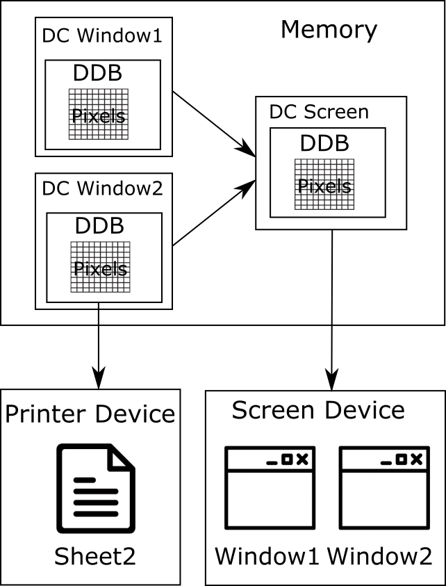

# Output Devices Capture

## Windows Graphics Device Interface

The Graphics Device Interface ([GDI](https://en.wikipedia.org/wiki/Graphics_Device_Interface)) is one of the basic Windows operation system components that responses to work with the graphical objects. All graphical elements of a typical application's window are constructed using the objects. Examples of the objects are Device Contexts, Bitmaps, Brushes, Colors and Fonts.

This scheme represents relationship between the graphical objects and devices:



The core concept of the GDI library is a Device Context ([DC](https://msdn.microsoft.com/en-us/library/windows/desktop/dd162467%28v=vs.85%29.aspx)). The DC is an abstraction that allows developers to operate with graphical objects in one universal way for all supported devices. Examples of devices are display, printer, plotter and etc. All operations with DC are performed into a memory before sending a result to the output device.

You can see the DC of two application windows in the scheme. Also this is a DC of the entire screen that represents overall Windows desktop. The screen DC is gotten by composing of DC content of all visible windows and desktop elements.

DC is a structure in a memory. Developers can interact with this kind of structure only through a Windows API functions. Each DC contain a Device Depended Bitmap (DDB). [Bitmap](https://msdn.microsoft.com/en-us/library/windows/desktop/dd162461%28v=vs.85%29.aspx) is a in-memory representation of the drawing surface. Any manipulation of the graphic objects in the DC affects the bitmap. Thus, bitmap displays a result of all performed operations.

Simplistically, bitmap consist of rectangle of pixels. Each pixel have two parameters that are coordinates and color. The compliance of the parameters are defined by two dimensional array. Indexes of the array's element defines a pixel's coordinates. Numeric value of the element defines a code of color in the color-palette that is associated with the bitmap. You should process this array pixel-by-pixel for analyzing a bitmap.

The prepared DC should be passed to the device specific library for example Vga.dll. The library transforms DC data to the device driver's representation. Then the image able to be displayed or document able to be printed on the output device.

## AutoIt Analysis Functions

### Analysis of Specific Pixel

AutoIt provides several functions that simplifies the analysis of the current screen state. All these functions operate with the GDI library objects.

The coordinate systems that is used by AutoIt pixel analyzing functions are totally the same as coordinate systems for mouse functions. This is a list of the avaliable coordinate systems:

0\. Relative coordinates to the specified window.<br/>
1\. Absolute screen coordinates. This mode is used by default.<br/>
2\. Relative coordinates to the client area of the specified window.

You can use the same [**Opt**](https://www.autoitscript.com/autoit3/docs/functions/AutoItSetOption.htm) AutoIt function with **PixelCoordMode** parameter to switch between the coordinate systems. This is example to switch the relative coordinates to the client area mode:
```AutoIt
Opt("PixelCoordMode", 2)
```
Elementary function to get pixel color is the [**PixelGetColor**](https://www.autoitscript.com/autoit3/docs/functions/PixelGetColor.htm). Input parameters of the function are pixel coordinates. Return value of the function is decimal code of a color. This is example **PixelGetColor.au3** script with usage of the function:
```AutoIt
$color = PixelGetColor(200, 200)
MsgBox(0, "", "The hex color is: " & Hex($color, 6))
```
You will see a message box with a text after launching the script. This is example of the possible text message:
```
The text color is: 0355BB
```
This means that the pixel with absolute coordinates equal to x=200 and y=200 have a color value 0355BB in a [hex representation](http://www.htmlgoodies.com/tutorials/colors/article.php/3478951). The color will be changed if you activate another application window that covers coordinates x=200 and y=200. This means that **PixelGetColor** doesn't analyze a specific window but instead it provides an information about entire Windows desktop. 

This screen-shoot of API Monitor application with hooked Windows API calls of the script:


You can see that AutoIt **PixelGetColor** wraps the [**GetPixel**](https://msdn.microsoft.com/en-us/library/windows/desktop/dd144909%28v=vs.85%29.aspx) Windows API function. Also a [**GetDC**](https://msdn.microsoft.com/en-us/library/windows/desktop/dd144871%28v=vs.85%29.aspx) WinAPI function is called before the **GetPixel** function. The input parameter of the **GetDC** function equal to NULL. This means that a desktop DC is selected to operating. Let's try to avoid this limitation and specify a window to analyze. It allows our script to analyze not active window that is overlapped by another one.

This is a **PixelGetColorWindow.au3** script that uses a third parameter of the **PixelGetColor** function to specify a window to analyze:
```AutoIt
$hWnd = WinGetHandle("[CLASS:MSPaintApp]")
$color = PixelGetColor(200, 200, $hWnd)
MsgBox(0, "", "The hex color is: " & Hex($color, 6))
```
This script should analyze a pixel into the Paint application window. The expected value of the pixel color is **FFFFFF** (white). But if you overlap the Paint window by another window with a not white color the result of script executing will differ. The API Monitor log of Windows API function calls for **PixelGetColorWindow.au3** script will be the same as for **PixelGetColor.au3** one. The NULL parameter is still passed to the **GetDC** WinAPI function. It looks like a bug of the **PixelGetColor** function implementation in AutoIt v3.3.14.1 version. Probably, it will be fixed in a next AutoIt version. But we still need to find a solution of the reading from a specific window issue.

A problem of **PixelGetColorWindow.au3** script is an incorrect use of **GetDC** WinAPI function. We can avoid it if all steps of the **PixelGetColor** Autoit function will be perform manually through Windows API calls.

This algorithm is implemented in a **GetPixel.au3** script:
```AutoIt
#include <WinAPIGdi.au3>

$hWnd = WinGetHandle("[CLASS:MSPaintApp]")
$hDC = _WinAPI_GetDC($hWnd)
$color = _WinAPI_GetPixel($hDC, 200, 200)
MsgBox(0, "", "The hex color is: " & Hex($color, 6))
```
**WinAPIGdi.au3** header is used in the script. It provides a **_WinAPI_GetDC** and **_WinAPI_GetPixel** wrappers to the corresponding WinAPI functions. You will see a message box with correct color measurement after the script launch. The result of the script work is not depend of the windows overlapping. 

But the script will not work properly if you minimize the Paint window. The script will show the same result equal to white color if you minimize the window. It seems correctly. But try to change a color of a canvas to red for example. If the window is in normal mode the script returns a correct red color. If the window is minimized the script returns a white color. This happens because a minimized window have a client area with a zero size. Therefore, the bitmap that is selected in the minimized window's DC does not contain an information about the client area.

This is a **GetClientRect.au3** script to measure a client area size of the minimized window:
```AutoIt
#include <WinAPI.au3>

$hWnd = WinGetHandle("[CLASS:MSPaintApp]")
$tRECT = _WinAPI_GetClientRect($hWnd)
MsgBox(0, "Rect", _
            "Left: " & DllStructGetData($tRECT, "Left") & @CRLF & _
            "Right: " & DllStructGetData($tRECT, "Right") & @CRLF & _
            "Top: " & DllStructGetData($tRECT, "Top") & @CRLF & _
            "Bottom: " & DllStructGetData($tRECT, "Bottom"))
```
Each of Left, Right, Top and Bottom variables will be equal to 0 for the minimized Paint window. You can compare this result with the window in a normal mode.

The possible solution to avoid this limitation is restoring window in a transparent mode and copying a window's client area by a [**PrintWindow**](https://msdn.microsoft.com/en-us/library/dd162869%28VS.85%29.aspx) WinAPI function. You able to analyze a copy of the window's client by the **_WinAPI_GetPixel** function. This technique described in details [here](http://www.codeproject.com/Articles/20651/Capturing-Minimized-Window-A-Kid-s-Trick).

### Analysis of Pixels Changing

AutoIt provide functions that allows you to analyze happened changes on a game screen. The **PixelGetColor** function relies on predefine pixel coordinates. But this kind of analysis does not work for situation when a picture on a screen is dynamically changing. The [**PixelSearch**](https://www.autoitscript.com/autoit3/docs/functions/PixelSearch.htm) can help in this case.

This is a **PixelSearch.au3** script to demonstrate the function work:
```AutoIt
$coord = PixelSearch(0, 207, 1000, 600, 0x000000)
If @error = 0 then
	MsgBox(0, "", "The black point coord: x = " & $coord[0] & " y = " & $coord[1])
else
	MsgBox(0, "", "The black point not found")
endif
```
The script looks for pixel with **0x000000** (black) color in a rectangle between two points: x=0 y=207 and x=1000 y=600. If the pixel have been found a message with coordinates will be displayed. Otherwise, a not found result message will be displayed. The [**@error** macro](https://www.autoitscript.com/autoit3/docs/functions/SetError.htm) is used here to distinguish a success of the **PixelSearch** function. You can launch a Paint application and draw a black point on the white canvas. If you launch the script afterwards you will get coordinates of the black point. The Paint window should be active and not overlapped for proper work of the script.

Now we will investigate internal WinAPI calls that is used by the **PixelSearch** function. Let's launch the **PixelSearch.au3** script in API Monitor application. Search a "0, 207" text in a "Summary" window when the script have finished. You will find a call of [**StretchBlt**](https://msdn.microsoft.com/en-us/library/windows/desktop/dd145120%28v=vs.85%29.aspx) function:


This **StretchBlt** function call performs copying a bitmap from a desktop DC to the created in a memory compatible DC. You can verify this assmuption by checking an input parameter and a return value of the previous **GetDC(NULL)** and [**CreateCompatibleDC**](https://msdn.microsoft.com/en-us/library/windows/desktop/dd183489%28v=vs.85%29.aspx) function calls. Next step is a [**GetDIBits**](https://msdn.microsoft.com/en-us/library/windows/desktop/dd144879%28v=vs.85%29.aspx) function call. Result of the function is retrieving pixels of the analyzing bitmap to the device independed byte array. This form of the pixels representation is a most convenient for analysis. Probable next step of the pixel search algorithm is pixel-by-pixel checking color in the resulting byte array. None WinAPI function is needed to perform this pixles checking. Therefore, you does not see any other calls in the API Monitor log. You can investigate an example of the image capturing [here](https://msdn.microsoft.com/en-us/library/dd183402%28v=VS.85%29.aspx).

The **PixelSearch** support a HWND input parameter which define a window to analyze. This is a "PixelSearchWindow.au3" script that demonstartes the input parameter usage:
```AutoIt
$hWnd = WinGetHandle("[CLASS:MSPaintApp]")
$coord = PixelSearch(0, 207, 1000, 600, 0x000000, 0, 1, $hWnd)
If @error = 0 then
	MsgBox(0, "", "The black point coord: x = " & $coord[0] & " y = " & $coord[1])
else
	MsgBox(0, "", "The black point not found")
endif
```
The script should analyze an overlapped Paint window but it does not. API Monitor log checking confirms that an issue is the same as a **PixelGetColor** function one. The **GetDC** function receives a **NULL** input parameter. Therefore, **PixelSearch** function process a desktop DC always.

[**PixelChecksum**](https://www.autoitscript.com/autoit3/docs/functions/PixelChecksum.htm) is another function that can be handy to analyze dynamically changing pictures. **PixelGetColor** and **PixelSearch** functions provides a precise information regarding to the specified pixel. **PixelChecksum** works different. It allows you to detect that something have been changed into a specified region of a screen. This kind of information is useful for performing bot's reaction on game events. But a further detailed analysis of a detected event is needed.

This is a **PixelChecksum.au3** script with a typical use case of the function:
```AutoIt
$checkSum = PixelChecksum(0, 0, 50, 50)

while $checkSum = PixelChecksum(0, 0, 50, 50)
    Sleep(100)
wend

MsgBox(0, "", "Something in the region has changed!")
```
Result of the script work is displaying a message if something have been changed in the desktop region between two points: x=0 y=0 and x=50 y=50. An initial value of a checksum is calculated in a first line of the scirpt. Further, the checksum value is recalculated and checked every 100 milliseconds in a while loop. The while loop continues until the checksum value still the same.

Let's consider how a **PixelChecksum** function works internally. API Monitor shows us exact the same WinAPI function calls for the **PixelChecksum**. It means that AutoIt uses the same algorithm as one that have been used in the **PixelSearch** function. The result of the algorithm is the device independed byte array of pixels. Next steo is a checksum calculation for the byte array with a selected algorithm. You can select either ADLER or CRC32 algorithm. A difference between algorithms is a speed and a reliability. CRC32 algorithm works slower but detects better a pixels changing.

The considered AutoIt functions are able to process pictures in fullscreen DirectX windows.

## Advanced Image Analysis Libraries

### FastFind Library

We have explored screen analysis functions that provided by AutoIt itself. Now we will investigate an external tools provided by third-party libraries.

[**FastFind**](https://www.autoitscript.com/forum/topic/126430-advanced-pixel-search-library/) provides advanced functions for searching pixels on a screen. The library's functions can be called from both AutoIt scripts and C++ applications.

These are steps to access the library's functions from AutoIt script:

1\. Create a project directory for your project for example with **FFDemo** name. 

2\. Copy a **FastFind.au3** file into the **FFDemo** directory.

3\. Copy either **FastFind.dll** or **FastFind64.dll** library to the **FFDemo** directory. The **FastFind64.dll** library is appropriate for x64 Windows systems. Overwise, you should use **FastFind.dll** library.

4\. Include the **FastFind.au3** file into your AutoIt script with an **include** keyword:
```AutoIt
#include "FastFind.au3"
```
These are steps to compile C++ application with **FastFind** library:

1\. Download a preferable C++ compiler. Visual Studio Community IDE from [Microsoft website](https://www.visualstudio.com/en-us/products/visual-studio-express-vs.aspx#) or [MinGW environment](http://nuwen.net/mingw.html).

2\. Install the C++ compiler on your computer.

3\. Create a source file with a **test.cpp** name if you use a MinGW compiler. Create a "Win32 Console Application" project if you use a Visual Studio IDE.

4\. This is a content of the source file:
```C++
#include <iostream>

#define WIN32_LEAN_AND_MEAN
#include <windows.h>

using namespace std;

typedef LPCTSTR(CALLBACK* LPFNDLLFUNC1)(void);

HINSTANCE hDLL;               // Handle to DLL
LPFNDLLFUNC1 lpfnDllFunc1;    // Function pointer
LPCTSTR uReturnVal;

int main()
{
	hDLL = LoadLibraryA("FastFind");
	if (hDLL != NULL)
	{
		lpfnDllFunc1 = (LPFNDLLFUNC1)GetProcAddress(hDLL,
			"FFVersion");
		if (!lpfnDllFunc1)
		{
			// handle the error
			FreeLibrary(hDLL);
			cout << "error" << endl;
			return 1;
		}
		else
		{
			// call the function
			uReturnVal = lpfnDllFunc1();
			cout << "version = " << uReturnVal << endl;
		}
	}
    return 0;
}
```
5\. Copy a **FastFind.dll** library into the source directory.

6\. If you use a MinGW create a file with **Makefile** name with this content:
```Makefile
all:
	g++ test.cpp -o test.exe
```
7\. Build the application with **make** command for MinGW and **F7** hotkey for Visual Studio.

Now you get an EXE binary file. You can launch it and get a message with a version number of **FastFind** library in a console:
```
version = 2.2
```
We have used an [explicitly library linking](https://msdn.microsoft.com/en-us/library/784bt7z7.aspx) approach here. Alternative approach is an [implicitly library linking](https://msdn.microsoft.com/en-us/library/d14wsce5.aspx). But you should use exactly the same compiler version as DLL library developer for this approach.

Now we will consider possible tasks that can be solved with **FastFind** library. First task is looking for an area containing the best number of pixels of the given color. This is a screenshoot of popular MMORPG game Lineage 2:


You can see on the screenshot a player character with a "Zagstruck" name and a [MOB](https://en.wikipedia.org/wiki/Mob_%28video_gaming%29) with a "Wretched Archer" name. We can use **FastFind** library to figure out a position of the MOB on a screen. **FFBestSpot** is an appropriate function for this case. It allows to find an area with the best number of pixels of the given color. The most reliable pixels to search is text labels under both characters. If we will look for pixels that are specific for the character's model it will not work reliably. This happens because the character's model is affected by shadows, light effects and also it able to turn around. A wide variation of pixel colors is a result of all these effects. Therefore, result of a **FFBestSpot** function will be variable. The MOB have an extra green label under it. This label can help us to distinguish MOB from the player character.

This is a **FFBestSpot.au3** script that performs a search of the green text and returns its coordinates:
```AutoIt
#include "FastFind.au3"

Sleep(5 * 1000)

const $SizeSearch = 80
const $MinNbPixel = 50
const $OptNbPixel = 200
const $PosX = 700
const $PosY = 380

$coords = FFBestSpot($SizeSearch, $MinNbPixel, $OptNbPixel, $PosX, $PosY, 0xA9E89C, 10)

if not @error then
    MsgBox(0, "Coords", $coords[0] & ", " & $coords[1])
else
    MsgBox(0, "Coords", "Match not found.")
endif
```
You can launch this script, switch to the window with a screenshot and get coordinates of the green text after 5 seconds. The script sleeps 5 second after a start that give you a time to switch the needed window. After that the **FFBestSpot** function is called. This is a list of parameters that are passed to the function:

1. **SizeSearch** - this is a width and height of the area to search for.
2. **MinNbPixel** - this is a minimum number of pixels with a given color in the area.
3. **OptNbPixel** - this is an optimal number of pixels with a given color in the area.
4. **PosX** and **PosY* - these are X and Y coordinates of proximity position.
5. **0xA9E89C** - this is a color in a hex representation.
6. **10** - this is a shade variation parameter from 0 to 255 that defines an allowed deviation from specified color for red, blue and green color's components.

Return value of the function is an array with three elements in case of success and 0 in case of failure. First two elements of the array are X and Y coordinates of the found area. Third element is a count of match pixels in the area. You can find a detailed information about this function in the **FastFind** documentation.

**FFBestSpot** function is an effective tool for searching interface elements like progress bars, icons, windows and text. Also you can try to search 2D models but result able to be not reliable enough.

Second task that able to be solved by **FastFind** library is a localization of the screen picture changes. This task is solved by **FFLocalizeChanges** function. We can use a Notepad application to demonstrate work of the function. The AutoIt script will localize the added text in the Notepad window.

This is a **FFLocalizeChanges.au3** script that solves the task:
```AutoIt
#include "FastFind.au3"

Sleep(5 * 1000)
FFSnapShot(0, 0, 0, 0, 0)

MsgBox(0, "Info", "Change a picture now")

Sleep(5 * 1000)
FFSnapShot(0, 0, 0, 0, 1)

$coords = FFLocalizeChanges(0, 1, 10)

if not @error then
    MsgBox(0, "Coords", "x1 = " & $coords[0] & ", y1 = " & $coords[1] & " x2 = " & $coords[2] & ", y2 = " & $coords[3])
else
    MsgBox(0, "Coords", "Changes not found.")
endif
```
You can launch a Notepad application and maximize its window. Then launch a **FFLocalizeChanges.au3** script and switch to the Notepad window. Start to type a text into the Notepad window when you see a message box with the "Change a picture now" text. The message box with coordinates of added text will appear after 5 seconds.

Functions of the **FastFind** library operating with SnapShots. SnapShot is a terms of the library and it means a copy of the screen in a memory. The SnapShot have been taken implicitly in the example of **FFBestSpot** function. But we take two SnapShot expicitly by **FFSnapShot** function in the **FFLocalizeChanges.au3** script. First SnapShot is taken in 5 seconds after the script launching. This delay is needed for switching to the Notepad window. Second SnapShot is taken in 5 seconds after the showing a message box with "Change a picture now" text. This delay is needed for performing your actions that will change the screen picture.

**FFSnapShot** function takes these parameters:

1. **0, 0, 0, 0** - these first four zeros are left, top, right and bottom coordinates of a SnapShot area. The whole screen is copied if all coordinates equal to zero.
2. **0** or **1** - last parameter is a number of the SnapShot slot. The maximum slot number is 1023.

Next **FFLocalizeChanges** function takes three parameters:

1. **0** - this is a slot number of the first SnapShot to compare.
2. **1** - this is a slot number of the second SnapShot to compare.
3. **10** - this is a shade variation parameter that works the same as for **FFBestSpot** function one.

Return value of the function is an array with five elements in case of success and 0 in case of failure. First four elements of the array are left, top, right and bottom coordinates of the changed region. Last element is a count of the changed pixels.

**FFLocalizeChanges** function can be effective alternative for the AutoIt provided **PixelChecksum**. It works more reliable and provide more information about the happened changes.

Functions of the **FastFind** library supports a work with the overlapped but not minimized windows. Most of them have a windows handle parameter that allows to specify a window for analyzing. Also the functions works correctly with fullscreen DirectX windows.

### ImageSearch Library

[**ImageSearch**](https://www.autoitscript.com/forum/topic/148005-imagesearch-usage-explanation) is a library that solves one specific task. It allows you to find a specific picture in the entire screen or in the specified region of the screen. Steps to access the library's functions from AutoIt script are similar to **FastFind** library ones:

1\. Create a project directory for your project for example with **FFDemo** name. 

2\. Copy an **ImageSearch.au3** file into the **FFDemo** directory.

3\. Copy a **ImageSearchDLL.dll** library into the **FFDemo** directory.

4\. Include the **ImageSearch.au3** file into your AutoIt script:
```AutoIt
#include "ImageSearch.au3"
```
Also you can use an explicitly library linking approach to compile C++ application that will use functions of the **ImageSearch** library. The approach have been described in details in the "FastFind library" section.

We will search a logo of Notepad window in our demonstration example. First of all you should make a file with a logo picture to search. You can use Paint application for this task. This is an example of picture that you should get:


This is a **Search.au3** script that performs a searching of the logo:
```AutoIt
#include <ImageSearch.au3>

Sleep(5 * 1000)

global $x = 0, $y = 0
$search = _ImageSearch('notepad-logo.bmp', 0, $x, $y, 20)

if $search = 1 then
    MsgBox(0, "Coords", $x & ", " & $y)
else
    MsgBox(0, "Coords", "Picture not found.")
endif
```

If you have faced with issues when launching a new version of the library you can download a previous stable version [here](https://github.com/ellysh/ImageSearch).

>>> Continue here

TODO: Is ImageSearch works with overlapped window?

TODO: Is ImageSearch works with DirectX fullscreen mode?