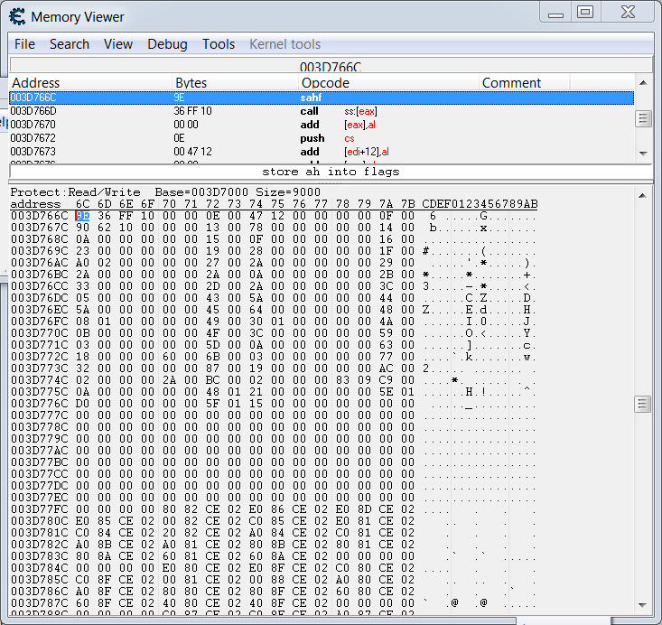
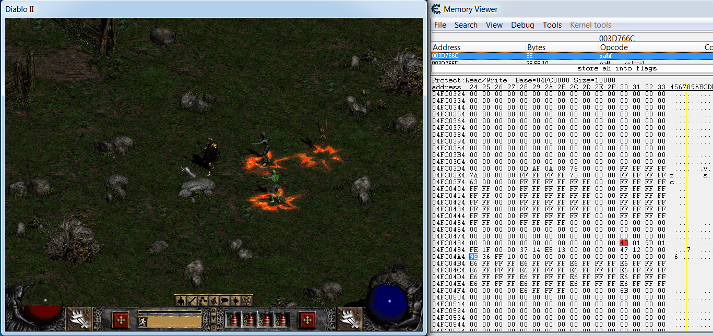
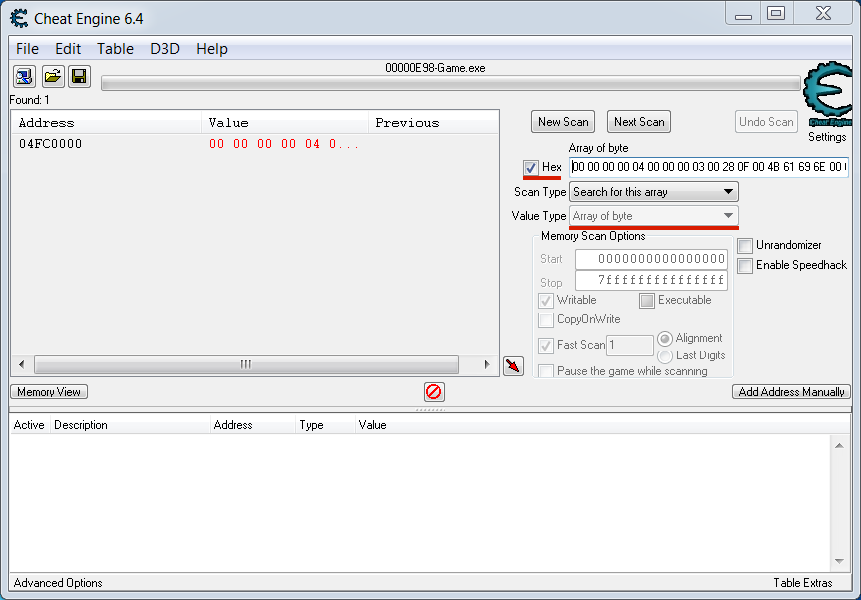

# Example with Diablo 2

## Diablo 2 Overview

Now we will write a simple in-game bot for the popular RPG game Diablo 2. Gameplay of Diablo 2 is quite typical for the RPG genre. Player should do quests, kill monsters and improve his character. Our example bot is focused on analysis of player character's state. When the state is changed, the bot performs some actions. Therefore, it will be helpful to consider parameters of the player character in details.

There is a screenshot of game window:


You can see a player character in the center of the screen. There is an yellow model of the knight. Also you can see the monsters around the player character. One of the monster is selected by the mouse cursor.

There is a screenshot of windows with player character's parameters:


There are two windows on the screenshot. Left window contains common information about the player character like his name "Kain", class "Paladin", level and experience points. This information available at the top side of the window. Also below there are attributes, that define behavior of the character during a game process. For example, the "Strength" attribute defines a damage amount that is delivered to the monsters by the player.

Right window contains a tree of character's skills. There are special abilities and combos that allow you to make a more damage or to improve significantly character's attributes. Each skill has a level. The level defines effectiveness of the skill usage. You can get detailed information about player character's parameters and skills in a [wiki page](http://diablo.gamepedia.com/Classes_%28Diablo_II%29)

Diablo 2 has a single player and a multiplayer game modes. We will consider the single player mode only. It allows us to stop game's process execution at any moment and to explore its memory without any time limitations. Otherwise the game client, that does not respond to game server's requests, will be disconnected. This limitation does not allow us to use a debugger and to break game application's execution for investigation its internals.

Diablo 2 is available for buying at the [Blizzard Entertainment website](https://eu.battle.net/shop/en/product/diablo-ii). There is an open source game with a [Flare](http://flarerpg.org/) name, that is available for free. It has a very close game mechanics and interface to the Diablo 2 ones. You can use the Flare game to try methods of memory investigation, that are described in this section. All these methods are applicable to the Flare game too. The main difference between the processes of analysis Diablo 2 and Flare games is a complexity. Diablo 2 has much more library modules and game objects in the memory than the Flare one. Thus, analysis of Diablo 2 process memory requires more efforts.

## Bot Overview

You can find detailed articles by Jan Miller about hacking the Diablo 2 game. This is a first [article](http://extreme-gamerz.org/diablo2/viewdiablo2/hackingdiablo2). This is a second [article](http://www.battleforums.com/threads/howtohackd2-edition-2.111214/). Approaches, that are described in the articles, are focused on changing a normal behavior of the game. These behavior changes are named hacks. But a bot applications should work in a different manner. The bot should react to state changes of the game objects. Possible bot actions are simulate player's actions or change a state of the game objects in a legal way according to the game rules. Meanwhile the game application is still working within its normal algorithms. State of all objects is still valid according to the game rules.

Our example in-game bot has a very simple algorithm:

1. Read current value of the player character's life parameter.
2. Compare the read value with the threshold value.
3. Use a healing potion to increase a value of the character's life parameter.

This algorithm allows us to keep a player character alive while there are still the healing potions. Nevertheless an implementation of so simple algorithm requires a deep research of the Diablo 2 process memory.

## Diablo 2 Memory Analysis

Now we are ready to start our analysis of the Diablo 2 process memory. First of all you should launch the game. The game is launched in a fullscreen mode by default. But it will be more convenient for us to launch the game in a windowed mode. It allows you to switch quickly between the game and memory scanner windows. There is an instruction how to launch the game in the windowed mode:

1. Right-click the "Diablo II" icon and click "Properties".
2. Click the "Shortcut" tab.
3. Add `-w` to the end of the "Target". For example: 
```
"C:\DiabloII\Diablo II.exe" -w
```

When the game is launched, you should select a "Single player" option, create a new character and start the game.

### Parameters Searching

Goal of our analysis is to find an address of the player character's life parameter into the game process memory. First and the most obvious way to achieve our goal is to use Cheat Engine memory scanner. You can launch Cheat Engine and try to search current value of the life parameter without any configuration of search options. This approach does not work for me. You will get a long list of the resulting addresses. If you continue searching by selecting "Next Scan" option with updated life value, the resulting list becomes empty.

Straightforward approach does not work. The primary reason of this issue is size and complexity of the Diablo 2 game itself. The game model is very complex, and there are a lot of game objects in the memory. Now we do not know, how a state and parameters of these objects are stored into the memory. Therefore, we can start our research from developing a method, that allows us to find a specific object into the memory. Let us look at the window with player character's attributes again. There are several parameters that are guaranteed to be unique for the player character object. We can name this kind of unique parameters as **artifacts** for the sake of brevity. What are artifacts for the player character object? This is a list of them:

1. **Character name**<br/>
This is extremely unlikely that other game object has the same name as a player character. If it happens, you can rename your character to guarantee its unique name.
2. **Experience value**<br/>
This is a long positive integer number. The number is able to appear in the other objects rarely. But you can change it easily by killing several monsters, and then make next memory scan operation with the new value.
3. **Stamina value**<br/>
This is a long positive number. You can change it easily too by running outside the city.

I suggest to select an experience value for searching. In case the value equals to zero, you can kill several monsters to change it. The value grows rapidly. This is a memory scan result for my case:


There are several values in game memory that equal to the character's experience value.

Next step is to distinguish the value that is contained inside the character object. First of all, we can clarify a type of owning segment for each of these variables. This is a shortened output of the `!address` command of the WinDbg debugger:
```
+ 0`003c0000  0`003e0000  0`00020000  MEM_PRIVATE MEM_COMMIT PAGE_READWRITE <unknown>
+ 0`03840000  0`03850000  0`00010000  MEM_PRIVATE MEM_COMMIT PAGE_READWRITE <unknown>
+ 0`03850000  0`03860000  0`00010000  MEM_PRIVATE MEM_COMMIT PAGE_READWRITE <unknown>
+ 0`04f50000  0`04fd0000  0`00080000  MEM_PRIVATE MEM_COMMIT PAGE_READWRITE <unknown>
```
You can see, that all found variables are stored into the segments of "unknown" type. What is the "unknown" type? We already know the segments of stack and heap types. WinDbg debugger can distinguish them well. Therefore, these "unknown" segments are neither stack nor heap type. These segments are able to be allocated by the [`VirtualAllocEx`](https://msdn.microsoft.com/en-us/library/windows/desktop/aa366890%28v=vs.85%29.aspx) WinAPI function. We can verify this assumption very simple by writing a [test application](https://ellysh.gitbooks.io/video-game-bots/content/Examples/InGameBots/Diablo2Example/VirtualAllocEx.cpp), that uses the `VirtualAllocEx` function. In case you launch this test application with WinDbg debugger, you will see a segment of "unknown" type in the application's memory map. The base address of the "unknown" segment has the same value as returned one by the `VirtualAllocEx` function. 

Segments analysis does not allow us to find the character's experience parameter. All of these "unknown" segments have the same type and flags. Therefore, we cannot distinguish them.

We can try another way to find the character object. It is obvious that parameters of the object will be changed, when a player performs actions. For example, coordinates of an object are changed when a character moves. Also live value is decreased when the character gains a damage from monsters. Consider this fact, we can analyze the nature of changes in the memory that is located near the character's experience parameter. Cheat Engine memory scanner provides a feature to display changes of a memory region in real-time. There is an algorithm to open a Memory Viewer window of the Cheat Engine application:

1. Select an address in the resulting list for inspection.
2. Left click on the address.
3. Select the "Browse this memory region" item in the pop-up menu.

Now you see this Memory Viewer window:



The Memory Viewer window is split into two parts. Disassembled code of current memory region is displayed at the upper part of the window. The memory dump in a hexadecimal format is displayed at the bottom part of the window. We will focus on the memory dump in our investigation. Value of the character's experience parameter is underlined by a red line on the screenshoot. It is not obvious, why the hexadecimal value "9E 36 FF 10" in the memory dump is equal to the actual value "285161118" of experience parameter in decimal. Our application is launched on x86 architecture. The architecture has [little-endian](https://en.wikipedia.org/wiki/Endianness#Little-endian) byte order. It means that you should reverse a byte order of the four byte integer to get its correct value. The hexadecimal value becomes equal to "10 FF 36 9E" in our case. You can use the standard windows Calculator application to make sure, that this hexadecimal value equals to the "285161118" one in decimal. Actually you can change a display type of the memory dump by left mouse clicking on it and selecting the "Display Type" item of the pop-up menu. But I recommend you to keep the display type in the "Byte hex" format. Because you do not know an actual size in bytes of the parameters that you are looking for.

Now you should place both windows of Memory Viewer and Diablo 2 application one near each other. It allows you to perform actions in the Diablo 2 window and to inspect a memory region simultaneously in the Memory Viewer. This is a screenshot with the results of this kind of memory inspection:



The memory region on the screenshot matches to the experience value with "04FC04A4" address. The address holds last position in the resulting list of the Cheat Engine scanner. Address value may differ in your case but the order of addresses in the resulting list should be the same. You can find the same memory region by opening the last address in your resulting list. Why we prefer this memory region instead of any other one? The reason is, this memory region contains more information about the player character. This is a list of parameters that have been detected thanks to our inspection:

| Parameter | Address | Offset | Size | Hex Value | Dec Value |
| -- | -- | -- | -- | -- | -- |
| Life | 04FC0490 | 490 | 2 | 40 01 | 320 |
| Mana | 04FC0492 | 492 | 2 | 9D 01 | 413 |
| Stamina | 04FC0494 | 494 | 2 | FE 1F | 8190 |
| Coordinate X | 04FC0498 | 498 | 2 | 37 14 | 5175 |
| Coordinate Y | 04FC04A0 | 4A0 | 2 | 47 12 | 4679 |
| Experience | 04FC04A4 | 4A4 | 4 | 9E 36 FF 10 | 285161118 |

All these parameters are underlined by the red color on the memory inspection screenshot. What new we have known about the character's parameters from this inspection? First of all, size of the life parameter equals to two bytes. It means that you should specify the "2 Byte" item of the "Value Type" option in the main window of Cheat Engine in case you want to search the life parameter. Also you can see, that some of the character's parameters have [alignment](https://en.wikipedia.org/wiki/Data_structure_alignment), which is not equal to four bytes. For example, let us consider the mana parameter at 04FC0492 address. You can check with calculator that 04FC0492 value is not divided to 4 without a remainder. It means that you should unselect the "Fast Scan" check-box in the main window of Cheat Engine for searching these parameters. This is a screenshot of correctly configured Cheat Engine window:


Two changed search options are underlined by red color on the screenshot. Now you can find a life parameter with the Cheat Engine scanner.

There is an "offset" column in our character's parameters table. Values in this column define an offset of each parameter  from the beginning of the character's object. Now we will discuss, how it is possible to find this object inside the process memory.

### Object Searching

Next question is, how our bot will be able to find the correct life parameter inside the memory of game process ? Let us scroll up the memory region with the experience parameter at 04FC04A4 address. You will see the character's name like it was happened in my case:


These four underscored bytes are equal to the "Kain" string. [String](https://en.wikipedia.org/wiki/String_%28computer_science%29#Null-terminated) values do not have a reversed byte order on the little-endian architecture unlike the integer ones. The reason is, string have the same internal structure as simple byte array in common case.

You can see that the memory block above character's name is zeroed. Now we start to make assumptions and to check them. Let us assume that character's name is stored close to the upper bound of character's object. How we can check this assumption? We can use OllyDbg debugger to make a breakpoint on the memory address, where character's name is stored. When the game application will try to read from or to write into this memory, it will be stopped by the breakpoint. Then we can investigate an application code on the breakpoint. It is probably that we will find some foorptints of object's bound.

This is an algorithm of searching object's bound:

1. Launch the OllyDbg debugger with administrator privileges. Attach the debugger to the Diablo 2 process.

2. Select by left mouse click the bottom-left sub-window of the debugger with the memory dump in hex format.

3. Press the *Ctrl+G* key to open the "Enter expression to follow" dialog.

4. Type an address of the string with character's name into the "Enter address expression" field. The address equals to 04FC00D value in my case. Then press the "Follow expression" button. Now the cursor in the memory dump sub-window points to a first byte of the string with character's name.

5. Scroll up in the memory dump sub-window to find the first non-zero byte at assumed object's border. Select this byte by left mouse click on it.

5. Press the *Shift+F3* key to open the "Set memory breakpoint" dialog. Select the "Read access" and "Write access" check-boxes in the dialog. Then press the "OK" button. Now a memory breakpoint has set.

6. Continue an execution of the Diablo 2 process by the *F9* key press. The process can be stopped on several events. One of them is our memory breakpoint. Other event, which happens often, is a break on access to the guarded memory page. You can check, what kind of the event is happened now in the status bar at the bottom side of OllyDbg window. Now you should continue a process execution until the "Running" status does not appear at the right-bottom corner of the OllyDbg window.

7. Switch to the Diablo 2 window. The game application should be stopped immediately after this switching.

8. Switch back to the OllyDbg window. The window should look like this:


What do we see in this screenshot? You can see the highlighted line of the disassembled code at the upper-left sub-window. This is a code line, where the read access to the memory address with our breakpoint has happened. This is the code line at the "03668D9F" address:
```
CMP DWORD PTR DS:[ESI+4], 4
```
Here the comparison between the integer of DWORD type at the "ESI + 4" address and "4" value is happened. **ESI** is a source index [CPU register](http://www.eecg.toronto.edu/~amza/www.mindsec.com/files/x86regs.html). ESI is always used in pair with the **DS** register. DS register holds a base address of the data segment. ESI register equals to "04FC0000" address in our case. You can find this value in the upper-right sub-window of the debugger, which contains current values of all CPU registers. This is common practice to hold object address in the ESI register. Let us inspect the disassembled code below the breakpoint line. You can see these lines that are started at the "03668DE0" address:
```
MOV EDI,DWORD PTR DS:[ESI+1B8]
CMP DWORD PTR DS:[ESI+1BC],EDI
JNE SHORT 03668DFA
MOV DWORD PTR DS:[ESI+1BC],EBX
```
All these operations look like processing of object's fields, where "1B8" and "1BC" values define offsets of fields from the object's bound. When you scroll down this disassembling listing, you will find similar operations with object's fields. It allows us to conclude that beginning address of the player character's object equals to the value of the ESI register, i.e. "04FC0000".

Now we can calculate an offset of the life parameter. This is the offset from a beginning address of character's object:
```
04FC0490 - 04FC0000 = 0x490
```
The offset equals to 490 in hexadecimal. Next question, how our bot will find beginning address of character's object? We have determined that the owning segment of the object has special "unknown" type. Also the segment has size of 80000 bytes in hexadecimal and it has these flags: `MEM_PRIVATE`, `MEM_COMMIT` and `PAGE_READWRITE`. There are minimum ten other segments that have the same byte size and flags. It means that we cannot find the necessary segment by traversing them.

Let us look at the first bytes of the character's object:
```
00 00 00 00 04 00 00 00 03 00 28 0F 00 4B 61 69 6E 00 00 00
```
If you restart the Diablo 2 application and find this character's object again, you see the same byte sequence at begining of the object. We can make an assumption, that this byte sequence matches to the unchanged character's parameters. This kind of parameters is defined at the character creation moment. Once they are set, they are never changed. This is a probable list of these parameters:

1. Character's name.
2. [Expansion character](http://diablo.wikia.com/wiki/Expansion_Character) flag.
3. [Hardcore mode](http://diablo.wikia.com/wiki/Hardcore) flag.
4. Encoded class of the character.

This unchanged byte sequence can be used as [**magic numbers**](https://en.wikipedia.org/wiki/Magic_number_%28programming%29) for searching character's object in the memory. Be aware that these "magic numbers" will be different for your case. Lack of flexibility is the main disadvantage of this approach. You can check correctness of the selected magic numbers with the Cheat Engine scanner. Select the "Array of byte" item of the "Value Type" option. Then select the "Hex" check-box and copy the first bytes of character's object into the "Array of byte" field. This is a searching result for my case:



You can see that the address of character's object has been changed. Now the address is equal to "04F70000". But offsets of all object's parameters are still the same. It means that the new address of character's life parameter equals to "04F70490".

## Bot Implementation

Now we have enough information to implement our bot application. This is a detailed algorithm of the bot:

1. Enable `SE_DEBUG_NAME` privilege for current process. It is needed to read memory of the Diablo 2 process.
2. Open the Diablo 2 process.
3. Search player character's object in the process memory.
4. Calculate an offset of character's life parameter.
5. Read a value of life parameter in loop. Use a healing potion if the value is less than 100.

First step of the algorithm has been described in the [Process Memory Access](process-memory-access.md) section. Second step is able to be implemented in two ways. We can either to use a hardcoded PID value as we did it before or to calculate the PID value of the process that owns current active window. PID calculation allows us to make the bot application more flexible and to avoid its recompilation before starting.

This is a code snippet that calculates a PID of the game process and opens it:
```C++
int main()
{
	Sleep(4000);

	HWND wnd = GetForegroundWindow();
	DWORD pid = 0;
	if (!GetWindowThreadProcessId(wnd, &pid))
	{
		printf("Error of the pid detection\n");
		return 1;
	}
	
	HANDLE hTargetProc = OpenProcess(PROCESS_ALL_ACCESS, FALSE, pid);
	if (!hTargetProc)
		printf("Failed to open process: %u\n", GetLastError());
	
	return 0;
}
```
Two WinAPI functions are used here. There are [`GetForegroundWindow`](https://msdn.microsoft.com/en-us/library/windows/desktop/ms633505%28v=vs.85%29.aspx) and [`GetWindowThreadProcessId`](https://msdn.microsoft.com/en-us/library/windows/desktop/ms633522%28v=vs.85%29.aspx). `GetForegroundWindow` function allows us to get a handle of current window in foreground mode. This is an active window with which the user is currently working. `GetWindowThreadProcessId` function retrieves a PID of the process that owns the specified window. The PID value is stored in the `pid` variable after execution of this code snippet. Also you can see four seconds delay at the first line of the `main` function. The delay provides enough time for us to switch to the Diablo 2 window after start of the bot application.

Third step of our bot algorithm is searching character's object. I suggest to use an approach that has been described in this [series of video lessons](https://www.youtube.com/watch?v=YRPMdb1YMS8&feature=share&list=UUnxW29RC80oLvwTMGNI0dAg). Lessons describe the process of implementation a memory scanner for video games. Algorithm of this scanner is very similar to the Cheat Engine scanner one. Core idea of the scanner is to traverse all memory segments of the game process via the [VirtualQueryEx](https://msdn.microsoft.com/en-us/library/windows/desktop/aa366907%28v=vs.85%29.aspx) WinAPI function. We will use exact the same function to traverse memory segments of the Diablo 2 process.

This is a code snippet that searches character's object in the Diablo 2 memory:
```C++
SIZE_T IsArrayMatch(HANDLE proc, SIZE_T address, SIZE_T segmentSize, BYTE array[],
				    SIZE_T arraySize)
{
	BYTE* procArray = new BYTE[segmentSize];

	if (ReadProcessMemory(proc, (void*)address, procArray, segmentSize, NULL) != 0)
	{
		printf("Failed to read memory: %u\n", GetLastError());
		delete[] procArray;
		return 0;
	}
	
	for (SIZE_T i = 0; i < segmentSize; ++i)
	{
		if ((array[0] == procArray[i]) && ((i + arraySize) < segmentSize))
		{
			if (!memcmp(array, procArray + i, arraySize))
			{
				delete[] procArray;
				return address + i;
			}
		}
	}

	delete[] procArray;
	return 0;
}

SIZE_T ScanSegments(HANDLE proc, BYTE array[], SIZE_T size)
{
	MEMORY_BASIC_INFORMATION meminfo;
	LPCVOID addr = 0;
	SIZE_T result = 0;

	if (!proc)
		return 0;

	while (1)
	{
		if (VirtualQueryEx(proc, addr, &meminfo, sizeof(meminfo)) == 0)
			break;

		if ((meminfo.State & MEM_COMMIT) && (meminfo.Type & MEM_PRIVATE) && 
			(meminfo.Protect & PAGE_READWRITE) && !(meminfo.Protect & PAGE_GUARD))
		{
			result = IsArrayMatch(proc, (SIZE_T)meminfo.BaseAddress, 
				meminfo.RegionSize, array, size);

			if (result != 0)
				return result;
		}
		addr = (unsigned char*)meminfo.BaseAddress + meminfo.RegionSize;
	}
	return 0;
}

int main()
{
	// Enable `SE_DEBUG_NAME` privilege for current process here.

	// Open the Diablo 2 process here.

	BYTE array[] = { 0, 0, 0, 0, 0x04, 0, 0, 0, 0x03, 0, 0x28, 0x0F, 0, 0x4B, 0x61,
					 0x69, 0x6E, 0, 0, 0 };

	SIZE_T objectAddress = ScanSegments(hTargetProc, array, sizeof(array));
	
	return 0;
}
```
`ScanSegments` function implements the algorithm of traversing the segments. There are three steps in a loop of this function:

1. Read via `VirtualQueryEx` WinAPI function current memory segment which base address equals to the `addr` variable.
2. Compare flags of current segment with the flags of a typical "unknown" segment. Skip the segment in case the comparison does not pass.
3. Search the discovered "magic numbers" of character's object into current segment.
4. Return resulting address of character's object.

Algorithm of "magic numbers" searching into current segment is provided by the `IsArrayMatch` function. This function is called from the `ScanSegments` one. There are two steps in the `IsArrayMatch` function:

1. Read data of entire current segment by the `ReadProcessMemory` WinAPI function.
2. Compare bytes of "magic numbers" array with the bytes of current segment in a loop.

Also the code snippet provides an example, how the `ScanSegments` function can be called from the `main` function. You should pass these input parameters to the function: handle of the Diablo 2 process, pointer to the "magic numbers" array and size of this array. Do not forget that "magic numbers" array will differ in your case.

Fourth step of the algorithm is calculation an address of the life parameter. The `objectAddress` variable returned by `ScanSegments` function is used for this calculation:
```C++
SIZE_T hpAddress = objectAddress + 0x490;
```
Now the `hpAddress` variable stores an address of the life parameter.

Last step of the algorithm contains checking of the life parameter value and usage of a healing potion in case the value is less than a threshold. This is a code snippet with implementation of both these actions:
```C++
WORD ReadWord(HANDLE hProc, DWORD_PTR address)
{
	WORD result = 0;

	if (ReadProcessMemory(hProc, (void*)address, &result, sizeof(result), NULL) == 0)
		printf("Failed to read memory: %u\n", GetLastError());

	return result;
}

int main()
{
	// Enable `SE_DEBUG_NAME` privilege for current process here.

	// Open the Diablo 2 process here.

	// Search a player character object here.

	// Calculate an offset of character's life parameter here.

	ULONG hp = 0;

	while (1)
	{
		hp = ReadWord(hTargetProc, hpAddress);
		printf("HP = %lu\n", hp);

		if (hp < 100)
			PostMessage(wnd, WM_KEYDOWN, 0x31, 0x1);

		Sleep(2000);
	}
	return 0;
}
```
Value of the life parameter is read in the infinite loop via `ReadWord` function. The `ReadWord` function is just a wrapper around the `ReadProcessMemory` WinAPI function. Then current value of the life parameter is printed to the console. You can check a correctness of entire algorithm of bot by comparing a printed life value with the actual one in the Diablo 2 game application.

If the life value is less than 100, the bot presses *1* hotkey to use a healing potion. The `PostMessage` WinAPI function is used here for key pressing simulation. Yes, this is not a "pure" way to embed data into the game process memory. We just inject a [`WM_KEYDOWN`](https://msdn.microsoft.com/en-us/library/windows/desktop/ms646280%28v=vs.85%29.aspx) message about a key pressing action into the event queue of the Diablo 2 process. This is the simplest way for player's actions simulation. More complex approaches of the simulation will be described further.

`PostMessage` function has four parameters. First parameter is a handle of the target window which receives the message. Second parameter is a message code. It is equal to `WM_KEYDOWN` in our case. Third parameter is a [virtual code](https://msdn.microsoft.com/en-us/library/windows/desktop/dd375731%28v=vs.85%29.aspx) of the pressed key. Fourth parameter of the function is an encoded set of several parameters. Most important one from this set is a repeat count for sent message. Bits from 0 to 15 are used to store the repeat count value. It is equal to "1" in our case. The key press simulation does not work if you specify a zero as the fourth parameter of the `PostMessage` function.

Complete implementation of the example bot is available in the [`AutohpBot.cpp`](https://ellysh.gitbooks.io/video-game-bots/content/Examples/InGameBots/Diablo2Example/AutohpBot.cpp) source file.

This is an algorithm to test the example bot:

1. Change the "magic numbers" according to your character. This is a code line to change:
```C++
	BYTE array[] = { 0, 0, 0, 0, 0x04, 0, 0, 0, 0x03, 0, 0x28, 0x0F, 0, 0x4B, 0x61,
					 0x69, 0x6E, 0, 0, 0 };
```
2. Compile the bot application with the new "magic numbers".
3. Launch the Diablo 2 game in windowed mode.
4. Launch the bot application with administrator privileges.
5. Switch to the Diablo 2 window during four seconds delay. After this delay the bot captures current active window and start to analyze its process.
6. Get a damage from monsters in the Diablo 2 game to decrease character's life parameter below the 100 value.

The bot presses *1* hotkey when character's life parameter becomes less than 100. Do not forget to assign a healing potion to the *1* hotkey. You can press *H* key to open a quick tips window. You will see a "Belt" hotkey panel in the right-bottom corner of the game window. You can drag and drop healing potions to the hotkey panel by left clicking on them.

### Further Improvements

Let us consider ways to improve our example bot application. First obvious issue of current bot implementation is usage only first socket of the hotkey panel. More effective solution is sequential usage of the slots from first to fourth number in the loop.

This is a code snippet with a new version of the checking life parameter loop:
```C++
	ULONG hp = 0;
	BYTE keys[] = { 0x31, 0x32, 0x33, 0x34 };
	BYTE keyIndex = 0;

	while (1)
	{
		hp = ReadWord(hTargetProc, hpAddress);
		printf("HP = %lu\n", hp);

		if (hp < 100)
		{
			PostMessage(wnd, WM_KEYDOWN, keys[keyIndex], 0x1);
			++keyIndex;
			if (keyIndex == sizeof(keys))
				keyIndex = 0;
		}
		Sleep(2000);
	}
```
Now list of virtual codes of keys is stored in the `keys` array. The `keyIndex` variable is used for indexing elements of the array. The `keyIndex` value is incremented each time when a healing potion is used. The index is reset back to zero value if it reaches a bound of the `keys` array. This approach allows us to use all healing potions in the hotkey panel one after each other. When the first row of potions becomes completely empty, the second row is used and so on.

Second possible improvements is analyzing character's mana parameter. It is simple to calculate offset of the parameter and read its value in the same checking loop. Bot is able to choose either healing or mana potion to use when character's life or mana parameter is low.

Simulate a key press action with `PostMessage` function is one of several ways to embed data into the game process memory. Another way is just to write a new value of the parameter to its address. 

This is a code snippet that demonstrates this approach:
```C++
void WriteWord(HANDLE hProc, DWORD_PTR address, WORD value)
{
	if (WriteProcessMemory(hProc, (void*)address, &value, sizeof(value), NULL) == 0)
		printf("Failed to write memory: %u\n", GetLastError());
}

int main()
{
	// Enable `SE_DEBUG_NAME` privilege for current process here.

	// Open a game process here.

	// Search a player character object here.

	// Calculate an offset of character's life parameter here.

	ULONG hp = 0;

	while (1)
	{
		hp = ReadWord(hTargetProc, hpAddress);
		printf("HP = %lu\n", hp);

		if (hp < 100)
			WriteWord(hTargetProc, hpAddress, 100);

		Sleep(2000);
	}
	return 0;
}
```
You can see that we have added an extra function with the `WriteWord` name. This is a simple wrapper over the `WriteProcessMemory` WinAPI function. Now the bot writes 100 value to the life parameter directly if the parameter's value becomes less than 100. This approach has an issue. It breaks the game rules. Therefore, it is probable that a state of game objects becomes inconsistent after this writing operation. You can try to launch this version of the bot for Diablo 2 application. The character's life parameter is still unchanged. It happens because the parameter's value is stored in several game objects. All these values are compared regularly by a control algorithm. The algorithm can fix incorrect values according to other ones. Exact the same values of parameters fixing happens for the on-line game. The fixing is happened on the server side in this case. We can conclude that this approach is able to be used for some games with single play mode only.

There is a third way to embed bot's data to the process. This is the [first](http://www.codeproject.com/Articles/4610/Three-Ways-to-Inject-Your-Code-into-Another-Proces) and the [second](http://www.codeproject.com/Articles/9229/RemoteLib-DLL-Injection-for-Win-x-NT-Platforms) article about code injection techniques. Core idea of these techniques is execution your code inside the game process. It means that the bot application has a direct access to call any function of the game application. You do not need to simulate any key press action now. Instead you can just call "UsePotion" function directly. But this approach requires deep analysis and reverse engineering of the game application.

Our example bot implements a very simple algorithm. It reacts to a low value of the life parameter and performs key presses. But is it possible to implement an in-game farm bot that will automatically hunt monsters? Yes, we can do it. The major task for a farm bot algorithm implementation is searching monsters in the game process memory. Now we know both X and Y coordinates of the player's character. They are specified in the player's character parameters table above. Both coordinates have a size equals to two bytes. Also Y coordinate follows the X coordinate without any gap. Now we can assume that the monsters near the player's character have coordinates with the close values. Bot application can scan the game memory to four byte number, which consist of couple values of two bytes size. Each appropriate search result is able to be added to a "possible monsters" list. Next action is filtering actual and wrong results. Tip for filtering algorithm is an assumption that all actual monsters' coordinates should have close addresses. Also bot application can remember a memory segment where the actual monsters' coordinates are stored. This segment will be used for all further scan operations. Bot can use the same approach of key press simulation with the `PostMessage` WinAPI function to hit monsters.

## Summary

We have implemented a typical in-game bot for Diablo 2 game. Let us consider its advantages and disadvantages. This evaluation is able to be generalized for entire class of in-game bots.

This is a list of advantages of clicker bots:

1. Bot application has precise information about game objects. Probability of bot's mistakes is very low.
2. Bot application has a lot of ways to modify state of the game objects. It can be simulation of player's actions, direct write operations to the game memory or call of internal game application's functions.

This is a list of disadvantages of clicker bots:

1. Investigation and reverse engineering of a game application need a lot of efforts and time.
2. Bot application is able to work with a specific version of the game application only in most cases. Bot should be adapted for each new game version.
3. There are a lot of effective approaches to protect applications against reverse engineering and memory analysis.

You can see that in-game bots require much more efforts to develop and support than clicker bots. At the same time, they are quite reliable because they can gather detailed information about game objects' state.
