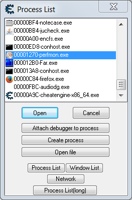
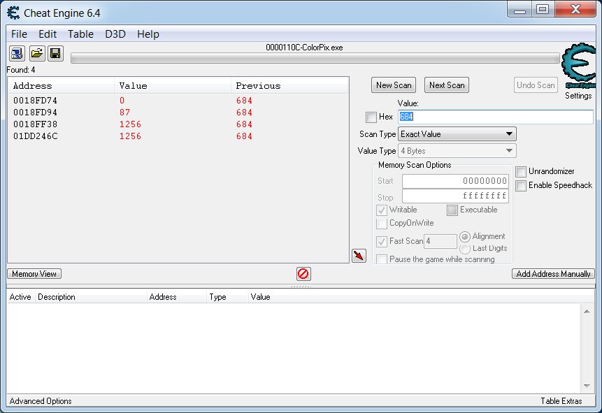
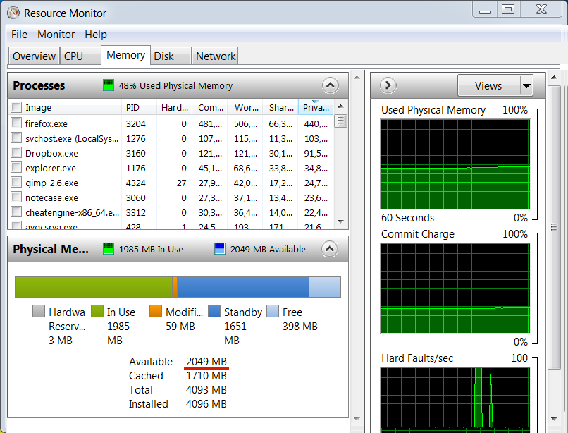

# Process Memory Analyzing

## Process Memory Overview

Process memory topic has been already described in many books in articles. We will consider points of the topic here that are the most important for practical goal of analyzing process memory.

First of all, it will be useful to emphasize a difference between an executable binary file and a working process from point of view of provided information for analyzing. We can compare executable file with a bowl. This bowl defines a future form of the poured liquid of data. Executable file contains algorithms for processing data, implicit description of ways to interpret data, global and static variables. Data description is represented by encoded rules of [**type system**](https://en.wikipedia.org/wiki/Type_system). Therefore, it is possible to investigate ways of data processing and representation, and values of initialized global and static variables from analyzing the executable file. When executable file is launched liquid starts to pour into a bowl. OS load executable file into the memory and starts to execute file's instructions. Typical results of instructions execution are allocation, modification or deallocation memory. It means that you can get actual information of application's work in the [**run-time**](https://en.wikipedia.org/wiki/Run_time_%28program_lifecycle_phase%29) only.

This is a scheme with components of a typical Windows process:


You can see that typical Windows process consist of several modules. EXE module exist always. It matches to the executable file that have been loaded into memory when application is launched. All Windows applications use at least one library which provides access to WinAPI functions. Compiler will link some libraries by default even if you does not use WinAPI functions explicitly in the application. Such WinAPI functions as `ExitProcess` or `VirtualQuery` are used by all applications for correct termination or process's memory management. These functions are embedded implicitly into the applications by compiler.

This is a point where will be useful to describe two types of libraries. There are dynamic-link libraries ([**DLL**](https://support.microsoft.com/en-us/kb/815065)) and static libraries. Key difference between them is a time of resolving dependencies. If executable file depends on a static library, the library should be available at compile time. Linker will produce one resulting file that contains both sources of the static library and executable file. If executable file depends on a DLL, the DLL should be available at compile time too. But resulting file will not contain sources of the library. It will be founded and loaded into process's memory at run-time by OS. Launched application will crash if OS will not found the required DLL. This kind of loaded into process's memory DLLs is a second type of modules.

[**Thread**](https://en.wikipedia.org/wiki/Thread_%28computing%29) is a set of instructions that can be executed separately from others in concurrent manner. Actually threads interacts between each other by shared resources such as memory. But OS is free to select which thread will be executed currently. Number of simultaneously executed threads is defined by number of CPU cores. You can see in the scheme that each module is able to contain one or more threads or do not contain threads at all. EXE module always contains a main thread which will be launched by OS at the moment of application's start.

Described scheme focuses on a mechanism of application's execution. Now we will consider a memory layout of a typical Windows application.


You can see an address space of the typical application. The address space is split into memory locations that are named [**segments**](https://en.wikipedia.org/wiki/Segmentation_%28memory%29). Each segment has base address, length and set of permissions (for example write, read, execute.) Splitting memory into segments simplifies memory management. Information about segment's length allows to hook violation of segment's bounds. Segment's permissions allow to control access to the segment.

The illustrated process have three threads including the main thread. Each thread has own [**stack segment**](https://en.wikipedia.org/wiki/Call_stack). Also there are several [**heap segments**](https://msdn.microsoft.com/en-us/library/ms810603) that can be shared between all threads. The process contains two modules. First is a mandatory EXE module and second is a DLL module. Each of these modules has mandatory segments like [`.text`](https://en.wikipedia.org/wiki/Code_segment), [`.data`](https://en.wikipedia.org/wiki/Data_segment#Data) and [`.bss`](https://en.wikipedia.org/wiki/.bss). Also there are extra module's segments like `.rsrc` that are not mentioned in the scheme.

This is a brief description of the each segment on the scheme:

| Segment | Description |
| -- | -- |
| Stack of main thread | Contains call stack, parameters of the called functions and [**automatic variables**](https://en.wikipedia.org/wiki/Automatic_variable). It is used only by the main thread. |
| Heap | Dynamic heap that is created by default at application's start. This kind of heaps can be created and destroyed on the fly during the process's work |
| Default heap | Heap that have been created by OS at application's start. This heap is used by all global and local memory management functions if a handle to certain dynamic heap is not specified. |
| Stack of thread 2 | Contains call stack, function parameters and automatic variables that are specific for thread 2 |
| EXE module `.text` | Contains executable instructions of the EXE module |
| EXE module `.data` | Contains not constant [**globals**](https://en.wikipedia.org/wiki/Global_variable) and [**static variables**](https://en.wikipedia.org/wiki/Static_variable) of the EXE module that have predefined values |
| EXE module `.bss` | Contains not constant globals and static variables of the EXE module that have not predefined values |
| Stack of thread 3 | Contains call stack, function parameters and automatic variables that are specific for thread 3 |
| Heap block 1 | Dynamic heap that have been created by [**heap manager**](http://wiki.osdev.org/Heap) when the default heap has reached a maximum available size. This heap extends the default heap. |
| DLL module `.text` | Contains executable instructions of the DLL module |
| DLL module `.data` | Contains not constant globals and static variables of the DLL module that have predefined values |
| DLL module `.bss` | Contains not constant globals and static variables of the DLL module that have not predefined values |
| Heap block 1 | Dynamic heap that have been created by heap manager after heap block 2 reached the maximum available size |
| TEB of thread 3 | **Thread Environment Block** ([TEB](https://en.wikipedia.org/wiki/Win32_Thread_Information_Block)) is a data structure that contains information about thread 3 |
| TEB of thread 2 | TEB that contains information about thread 2 |
| TEB of main thread | TEB that contains information about main thread |
| PEB | **Process Environment Block** ([PEB](https://msdn.microsoft.com/en-us/library/windows/desktop/aa813706%28v=vs.85%29.aspx)) is a data structure that contains information about a whole process |
| User shared data | Contains memory that is shared by current process with other processes |
| Kernel memory | Contains memory that is reserved by OS purposes like device drivers and system cache |

Segments that are able to store a state of a game's objects are market by red color in the scheme. Base addresses of these segments are assigned at the moment of application's start. It means that these addresses will differ each time when you launch an application. Moreover, sequence of these segments in the process's memory is not predefined too. On the other hand, base addresses and sequence of some segments are predefined. Examples of these segments are PEB, user shared data and kernel memory.

OllyDbg debugger allows you to get memory map of the working process. This is a screenshot of this memory map analyzing feature of the debugger:


First screenshot represent a beginning of the process's address space. There is an end of process's address space at the second screenshot. You can see the same segments on the screenshots as ones in the scheme:

| Address | Segment |
| -- | -- |
| 001ED000 | Stack of main thread |
| 004F0000 | Heap |
| 00530000 | Default heap |
| 00ACF000<br>00D3E000<br>0227F000 | Stacks of additional threads |
| 00D50000-00D6E000 | Segments of the EXE module with "ConsoleApplication1" name |
| 02280000-0BB40000<br>0F230000-2BC70000 | Dynamic heap blocks |
| 0F0B0000-0F217000 | Segments of the DLL module with "ucrtbased" name |
| 7EFAF000<br>7EFD7000<br>7EFDA000 | TEB of additional threads |
| 7EFDD000 | TEB of main thread |
| 7EFDE000 | PEB of main thread |
| 7FFE0000 | User shared data |
| 80000000 | Kernel memory |

You can notice that OllyDbg does not detect dynamic heap blocks automatically. You can use HeapMemView utility to clarify base addresses of all heap segments.

## Stack vs Heap

TODO: Describe mechanism of a memory allocation in both stack and heap. Compare it with point of view predictability of the variable offset in the stack and heap segments.

## Variables Searching

Task of searching a specific variable in the application's memory is able to be divided into three subtasks:

1. Find a segment which contains the variable.
2. Define a base address of this segment.
3. Define an offset of the variable inside the segment.

Most probably, the variable will be kept in the same segment on each application's launch. Storing the variable in a heap is only one case when the owning segment can vary. It happens because of dynamic heaps creation mechanism. Therefore, it is possible to solve first task by analyzing application's memory in a run-time manually and then to hardcode the result into a bot application. 

It is not guarantee that variable's offset inside a segment will be the same on each application's launch. But the offset may remain unchanged or constant during several application's launch in some cases and it can vary in other cases. Type of owning segment defines, how it is probable that variables' offsets inside this segment will be constant. This is a table that describes this kind of probability:

| Segment Type | Offset Constancy |
| -- | -- |
| `.bss` | Always constant |
| `.data` | Always constant |
| stack | Offset is constant in most cases. It can vary when [**control flow**](https://en.wikipedia.org/wiki/Control_flow) of application's execution differs between new application's launches. |
| heap | Offset vary in most cases |

Task of segment's base address definition should be solved by the bot application each time when a game application is launched.

### 32-bit Application Analyzing

Memory of [ColorPix](https://www.colorschemer.com/colorpix_info.php) 32-bit application will be considered now. This application have been described and used in "Clicker Bots" chapter. This is a screenshoot of the application's window:


We will looking for a variable in memory that matches to the X coordinate of the selected pixel on the screen. This value is underscored by red line in the screenshot. 

First task is looking for a segment which contains a variable with X coordinate value. This task can be done in two steps:

1. Find absolute address of the variable with Cheat Engine memory scanner.
2. Compare discovered absolute address with base addresses and lengths of process's segments. It will allow to deduce a segment which contains the variable.

This is an algorithm of searching the variable's absolute address with Cheat Engine scanner:

1. Launch 32-bit version of the Cheat Engine scanner with administrator privileges.
2. Select "Open Process" item of the "File" menu. You will see a dialog with list of launched applications at the moment:



3. Select the process with a "ColorPix.exe" name in the list and press "Open" button. Now the process's name is displayed above a progress bar at the top of Cheat Engine's window.

4. Type current value of the X coordinate into the "Value" control of the Cheat Engine's window.

5. Press the "First Scan" button to start searching the typed value into memory of ColorPix application. Number in the "Value" control should match the X coordinate that is displayed in ColorPix window at the moment when you are pressing the "First Scan" button. You can use `Tab` and `Shift`+`Tab` keys to switch between "Value" control and "First Scan" button. It allows you to keep pixel coordinate the same.

Search results will be displayed in the list of Cheat Engine's window:



If there are more than two absolute addresses in the results list you should cut off inappropriate variables. Move mouse to change X coordinate value of the current pixel. Then type new value into the "Value" control and press "Next Scan" button. Be sure that the new value differs from a previous one. There are still two variables after cutting of inappropriate ones with absolute addresses equal to "0018FF38" and "0025246C".

Now we know two absolute address of variables that matches to X coordinate. Next step is investigation of process's segments with debugger to figure out the segment which contains the variables. The OllyDbg debugger will be used in our example. 

This is an algorithm of searching the segment:

1. Launch OllyDbg debugger administrator privileges. Example path of the debugger's executable file is `C:\Program Files (x86)\odbg201\ollydbg.exe`.

2. Select "Attach" item of the "File" menu. You will see a dialog with list of launched 32-bit applications at the moment:


3. Select the process with a "ColorPix.exe" name in the list and press "Attach" button. When attachment process will be finished you will see a "Paused" text in the right-bottom corner of the OllyDbg window.

4. Press `Alt`+`M` to open memory map of the ColorPix process. The OllyDbg window should looks like this now:


You can see that variable with absolute address "0018FF38" matches the "Stack of main thread" segment. This segment occupies addresses from "0017F000" to "0018FFFF" because base address of the next segment equals to "00190000". Second variable with absolute address "0025246C" matches to unknown segment with "00250000" base address. It will be more reliable to select "Stack of main thread" segment for reading value of the X coordinate in future. There is much easer to find a stack segment than some kind of unknown segment.

Last task of searching specific variable is definition variable's offset inside the owning segment. You should subtract a base address of the segment from the absolute address of the variable. This is example of calculation for our case:
```
0018FF38 - 0017F000 = 10F38
```
The offset equals to "10F38".

TODO: Describe a way to find variable in the next application launch:
    1. Launch application
    2. Attach Ollydbg
    3. Get base address of the stack
    4. Calculate address of the variable with offset
    5. Read memory dump at the resulting absolute address

### 64-bit Application Analyzing

We will use a standard Resource Monitor application of Windows 7. You can launch it by typing `perfmon.exe /res` command in a search box of "Start" Windows menu. This is the application's screenshot:

TODO: Fix this screenshot. Now we will analyze "Free Memory" amount because of constant offset in the heap segment.



The "Available" memory amount is underscored by red line. We will search corresponding variable in the memory of Resource Monitor application. Bitness  of Resource Monitor application matches to the bitness of the Windows OS. It means that if you have 64-bit Windows, Resource Monitor bitness will be equal to 64-bit too.

It is important to emphasize that you should not close the Resource Monitor application during all process of analysis. If you close and restart the application you should start to search variable from the beginning.

First task is looking for a segment which contains a variable with the available memory amount. This task can be done in two steps:

1. Find absolute address of the variable with Cheat Engine memory scanner.
2. Compare discovered absolute address with base addresses and lengths of process's segments. It allows to deduce a segment which contains the variable.

This is an algorithm of searching the variable's address with Cheat Engine scanner:

1. Launch 64-bit version of the Cheat Engine scanner with administrator privileges.
2. Select "Open Process" item of the "File" menu. You will see a dialog with list of launched applications at the moment:


3. Select the process with a "perfmon.exe" name in the list and press "Open" button. Now the process's name is displayed above the progress bar at the top of Cheat Engine's window.

4. Type current value of the available memory amount into the "Value" control of the Cheat Engine's window.

5. Press the "First Scan" button to scan memory of Resource Monitor. Number in the "Value" control should match the memory amount that is displayed in Resource Monitor window when you are pressing the button.

Search result will be displayed in the list of Cheat Engine's window:


If there are several values in the results list you should cut off incorrect variables. Type new value of the the available memory amount into the "Value" control and press "Next Scan" button. Be sure that the new value differs from a previous one. You can launch any application like Notepad for changing the available memory amount.

Now we know an absolute address of the variable. The address equals to "00352FF4" in hexadecimal system. Next step is investigation of process's segments with debugger to figure out the segment which contains the variable. Difference between x64dbg and OllyDbg debuggers is automatically detection of stack and heap segments in the process's memory map. OllyDbg detects these kinds of segments automatically but x64dbg does not. It is possible to repeat this segments detection of OllyDbg debugger manually. Each TEB segment contains base address of the thread's stack segment. PEB segment contains base address of the default heap segment.

This is an algorithm of searching the segment:

1. Launch 64-bit version of the x64dbg debugger administrator privileges. Example path of the debugger's executable file is `C:\Program Files\x64dbg\release\x64\x64dbg.exe`.

2. Select "Attach" item of the "File" menu. You will see a dialog with list of launched 64-bit applications at the moment:


3. Select the process with a "perfmon.exe" name in the list and press "Attach" button. When attachment process will be finished you will see a "Paused" text in the left-bottom corner of the x64dbg window.

4. Switch to the "Memory Map" tab to see process's memory segments. The x64dbg window should looks like this now:


TODO: Describe algorithm:
+1. Use Cheat Engine for searching variable address
2. Attach OllyDbg to clarify the variable's segment

TODO: Add screenshots of OllyDbg memory map. Describe methods of investigation it.

## Summary

TODO: Describe how to manually read discovered variable in memory with xdbg64 after new application launch.