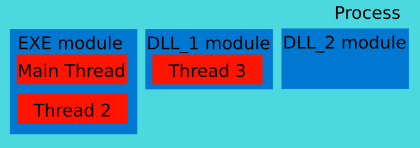
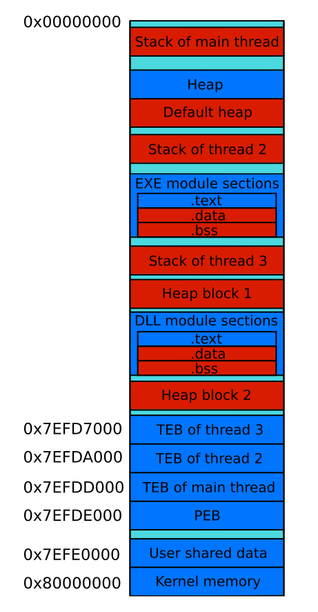

# Process Memory Analyzing

## Process Memory Overview

Process memory topic has been already described in many books in articles. We will consider points of the topic here that are the most important for practical goal of analyzing process memory.

First of all, it will be useful to emphasize a difference between an executable binary file and a working process from point of view of provided information for analyzing. We can compare executable file with a bowl. This bowl defines a future form of the poured liquid of data. Executable file contains algorithms for processing data, implicit description of ways to interpret data, global and static variables. Data description is represented by encoded rules of [**type system**](https://en.wikipedia.org/wiki/Type_system). Therefore, it is possible to investigate ways of data processing and representation, and values of initialized global and static variables from analyzing the executable file. When executable file is launched liquid starts to pour into a bowl. OS load executable file into the memory and starts to execute file's instructions. Typical results of instructions execution are allocation, modification or deallocation memory. It means that you can get actual information of application's work in the [**run-time**](https://en.wikipedia.org/wiki/Run_time_%28program_lifecycle_phase%29) only.

This is a scheme with components of a typical Windows process:

You can see that typical Windows process consist of several modules. EXE module exist always. It matches to the executable file that have been loaded into memory when application is launched. All Windows applications use at least one library which provides access to WinAPI functions. Compiler will link some libraries by default even if you does not use WinAPI functions explicitly in the application. Such WinAPI functions as `ExitProcess` or `VirtualQuery` are used by all applications for correct termination or process's memory management. These functions are embedded implicitly into the applications by compiler.

This is a point where will be useful to describe two types of libraries. There are dynamic-link libraries ([**DLL**](https://support.microsoft.com/en-us/kb/815065)) and static libraries. Key difference between them is a time of resolving dependencies. If executable file depends on a static library, the library should be available at compile time. Linker will produce one resulting file that contains both sources of the static library and executable file. If executable file depends on a DLL, the DLL should be available at compile time too. But resulting file will not contain sources of the library. It will be founded and loaded into process's memory at run-time by OS. Launched application will crash if OS will not found the required DLL. This kind of loaded into process's memory DLLs is a second type of modules.

[**Thread**](https://en.wikipedia.org/wiki/Thread_%28computing%29) is a set of instructions that can be executed separately from others in concurrent manner. Actually threads interacts between each other by shared resources such as memory. But OS is free to select which thread will be executed currently. Number of simultaneously executed theads is defined by number of CPU cores. You can see in the scheme that each module is able to contain one or more threads or do not contain threads at all. EXE module always contains a main thread which will be launched by OS at the moment of application's start.

Described scheme focuses on a mechanism of application's execution. Now we will consider a memory layout of a typical Windows application.

You can see an address space of the typical application. The address space is splitted into memory locations that are named [**segments**](https://en.wikipedia.org/wiki/Segmentation_%28memory%29). Each segment has base address, length and set of permissions (for example write, read, execute.) Splitting memory into segments simplifies memory management. Information about segment's length allows to hook violation of segment's bounds. Segment's permissions allow to control access to the segment.

The illustrated process have three threads including the main thread. Each thread has own [**stack segment**](https://en.wikipedia.org/wiki/Call_stack). Also there are several [**heap segments**](https://msdn.microsoft.com/en-us/library/ms810603) that can be shared between all threads. The process contains two modules. First is a mandatory EXE module and second is a DLL module. Each of these modules has mandatory segments like [`.text`](https://en.wikipedia.org/wiki/Code_segment), [`.data`](https://en.wikipedia.org/wiki/Data_segment#Data) and [`.bss`](https://en.wikipedia.org/wiki/.bss). Also there are extra module's segments like `.rsrc` that are not mentioned in the scheme.

This is a brief description of the each segment on the scheme:

| Segment | Description |
| -- | -- |
| Stack of main thread | Contains call stack, parameters of the called functions and [**automatic variables**](https://en.wikipedia.org/wiki/Automatic_variable). It is used only by the main thread. |
| Heap | Dynamic heap that is created by default at application's start. This kind of heaps can be created and destriyed on the fly during the process's work |
| Default heap | Heap that have been created by OS at application's start. This heap is used by all global and local memory management functions if a handle to certain dynamic heap is not specified. |
| Stack of thread 2 | Contains call stack, function parameters and automatic variables that are specific for thread 2 |
| EXE module `.text` | Contains executable instructions of the EXE module |
| EXE module `.data` | Contains not constant [**globals**](https://en.wikipedia.org/wiki/Global_variable) and [**static variables**](https://en.wikipedia.org/wiki/Static_variable) of the EXE module that have pre-defined values |
| EXE module `.bss` | Contains not constant globals and static variables of the EXE module that have not pre-defined values |
| Stack of thread 3 | Contains call stack, function parameters and automatic variables that are specific for thread 3 |
| Heap block 1 | Dynamic heap that have been created by [**heap manager**](http://wiki.osdev.org/Heap) after the default heap reached the maximum available size |
| DLL module `.text` | Contains executable instructions of the DLL module |
| DLL module `.data` | Contains not constant globals and static variables of the DLL module that have pre-defined values |
| DLL module `.bss` | Contains not constant globals and static variables of the DLL module that have not pre-defined values |
| Heap block 1 | Dynamic heap that have been created by heap manager after heap block 2 reached the maximum available size |
| TEB of thread 3 | **Thread Environment Block** ([TEB](https://en.wikipedia.org/wiki/Win32_Thread_Information_Block)) is a data structure that contains information about thread 3 |
| TEB of thread 2 | TEB that contains information about thread 2 |
| TEB of main thread | TEB that contains information about main thread |
| PEB | **Process Environment Block** ([PEB](https://msdn.microsoft.com/en-us/library/windows/desktop/aa813706%28v=vs.85%29.aspx)) is a data structure that contains information about a whole process |
| User shared data | Contains memory that is shared by current process with other processes |
| Kernel memory | Contains memory that is reserved by OS purposes like device drivers and system cache |

Segments that can store a state of game's objects are market by red color in the scheme. Base addresses of these segments are assigned at the moment of application's start. It means that these addresses will differ each time when you launch an application. Moreover, sequence of these segments in the process's memory is not predefined too.

OllyDbg debugger allows you to get memory map of the working process. This is a screenshot of this memory map analyzing feature of the debugger:

TODO: Add a brief description of the screenshots.

## Variables Searching

Task of searching specific variable in the application's memory can be divided into three tasks:

1. Find a segment which contains the variable.
2. Determine a base address of this segment.
3. Determine an offset of the variable inside the segment.

Most probably, the variable will be kept in the same segment in each application's launch. Storing the variable in a heap is only one case when the segment can be changed. It happens because of dynamic heaps creation mehanism. Therefore, it is possible to solve first task by analyzing application's memory  in run-time manually and to hardcode the result into a bot application. The other two tasks should be solved by the bot application each time at startup.

### Search in Module's Segments

TODO: Describe algorithm:
1. Use CheatEngne for seaching variable address
2. Attach OllyDbg to clarify the variable's segment

TODO: Add screenshots of OllyDBG memory map. Describe methods of investigation it.

### Search in Heap

TODO: Describe the heap growing process with example application

TODO: Describe WinAPI functions for looking for all heap's segments

### Search in Stack

TODO: Describe the stack growing process with example application

TODO: Describe WinAPI functions for looking for all stack's segments
